# 🚀 Project CUA (Computer User Assistance)

[](LICENSE)
[](https://github.com/myselfgus/cua/actions)
[](https://github.com/myselfgus/cua/releases)
[](docs/ARCHITECTURE.md)

> **Rich conversational + execution agent platform** with advanced AI capabilities, sandbox integration, and real-time collaboration features.

## 📋 Table of Contents

<details>
<summary>🔍 Click to expand navigation</summary>

- [🎯 Vision & Architecture](#-vision--architecture)
- [🛠️ Tech Stack](#️-tech-stack)
- [🏗️ System Architecture](#️-system-architecture)
- [📁 Repository Structure](#-repository-structure)
- [🚀 Quick Start](#-quick-start)
- [🔧 Development Setup](#-development-setup)
- [🌐 Environment Configuration](#-environment-configuration)
- [📦 Dependencies & Requirements](#-dependencies--requirements)
- [🔄 Workflows & Pipelines](#-workflows--pipelines)
- [📚 Referenced Repositories](#-referenced-repositories)
- [🧪 Testing Strategy](#-testing-strategy)
- [🚀 Deployment](#-deployment)
- [🤝 Contributing](#-contributing)
- [📖 Documentation](#-documentation)

</details>

## 🎯 Vision & Architecture

Project CUA is an **advanced AI agent platform** that combines:

- 🖥️ **Rich Frontend**: Modified LobeChat with artifact tabs (code editor, terminal, media, sandbox)
- 🧠 **Intelligent Backend**: FastAgent orchestrator with tool routing and planning
- 🔌 **Extensible Tools**: MCP servers for GitHub, Playwright, SSH, databases, and E2B sandboxes
- ⚡ **Low Latency**: Direct client connections to specialized services
- 🔒 **Secure Execution**: Isolated sandbox environments with controlled access

```mermaid
graph TB
    subgraph "Client Layer"
        UI[🖥️ LobeChat Frontend]
        STT[🎤 Speech-to-Text]
        TTS[🔊 Text-to-Speech]
        Tabs[📑 Artifact Tabs]
    end

    subgraph "Orchestration Layer"
        FA[🧠 FastAgent Backend]
        AG[🤖 AI Gateway]
        MG[🔌 MCP Gateway]
    end

    subgraph "Data Layer"
        Redis[(🗄️ Redis Cache)]
        Qdrant[(🔍 Vector DB)]
        Neo4j[(🕸️ Graph DB)]
    end

    subgraph "Tool Layer"
        GH[📝 GitHub MCP]
        PW[🌐 Playwright MCP]
        SSH[🖥️ SSH MCP]
        E2B[📦 E2B Sandbox]
    end

    UI --> FA
    UI --> AG
    UI --> Qdrant
    UI --> Neo4j
    FA --> MG
    FA --> Redis
    MG --> GH
    MG --> PW
    MG --> SSH
    FA --> E2B
```



## 🛠️ Tech Stack

<details>
<summary>📊 Comprehensive Technology Overview</summary>

| Layer | Technology | Purpose | Key Features |
|-------|------------|---------|--------------|
| **Frontend** | [LobeChat](https://github.com/lobehub/lobe-chat) (React/Next.js) | Rich UI with artifact visualization | Custom hooks, STT/TTS, multi-tab interface |
| **Backend** | [FastAgent](https://github.com/agentic-ai/fast-agent) (FastAPI) | Orchestration & tool routing | Async processing, tool planning, artifact generation |
| **Protocol** | [MCP](https://github.com/modelcontextprotocol/spec) | Tool integration standard | Secure, extensible tool ecosystem |
| **AI Gateway** | Cloudflare AI Gateway + OpenAI | AI model routing & caching | Multi-provider support, fallback mechanisms |
| **Cache** | Redis | Session & artifact storage | High-performance, distributed caching |
| **Vector DB** | [Qdrant](https://github.com/qdrant/qdrant) | Semantic search & memory | Vector similarity, contextual retrieval |
| **Graph DB** | [Neo4j](https://github.com/neo4j/neo4j) | Knowledge graph & relationships | Complex query support, graph analytics |
| **Sandbox** | [E2B](https://github.com/e2b-dev/e2b) | Code execution environment | Secure isolation, GPU support |

</details>

## 🏗️ System Architecture
### 🔄 Core Workflows

The system implements three primary workflow patterns:

<details>
<summary>📤 Message Processing Flow</summary>


</details>

<details>
<summary>🛠️ Tool Execution Flow</summary>


</details>

<details>
<summary>🎯 Artifact Management Flow</summary>


</details>

## 📁 Repository Structure

```
🏗️ project-cua/
├── 📱 frontend/                    # LobeChat Modified
│   ├── 🎣 src/hooks/              # Custom React hooks
│   │   ├── useArtifacts.ts        # Artifact state management
│   │   ├── useCUA.ts              # E2B sandbox integration
│   │   ├── useSTT.ts              # Speech-to-text
│   │   └── useTTS.ts              # Text-to-speech
│   ├── 🧩 src/components/
│   │   ├── ArtifactViewer/        # Unified artifact display
│   │   ├── TerminalTab/           # XTerm.js integration
│   │   ├── CodeEditor/            # Monaco editor
│   │   └── MediaViewer/           # Image/video display
│   ├── 🔧 src/utils/
│   │   ├── cache/                 # Redis client utilities
│   │   ├── mcp/                   # MCP protocol helpers
│   │   └── streaming/             # WebRTC/SSE handlers
│   └── 📋 package.json            # Dependencies & scripts
├── ⚙️ backend/                     # FastAgent Backend
│   ├── 🧠 app/core/
│   │   ├── tool_executor.py       # MCP tool orchestration
│   │   ├── cache_manager.py       # Redis cache abstraction
│   │   ├── intent_router.py       # Request routing logic
│   │   └── artifact_processor.py  # Response transformation
│   ├── 🛣️ app/routes/
│   │   ├── intents.py             # Main conversation endpoint
│   │   ├── artifacts.py           # Artifact CRUD operations
│   │   ├── health.py              # System health checks
│   │   └── websocket.py           # Real-time connections
│   ├── 📦 app/models/
│   │   ├── artifacts.py           # Pydantic models
│   │   ├── sessions.py            # User session models
│   │   └── tools.py               # Tool configuration
│   ├── 🔌 app/services/
│   │   ├── mcp_client.py          # MCP Gateway client
│   │   ├── ai_gateway.py          # AI model integration
│   │   ├── e2b_client.py          # E2B sandbox client
│   │   └── memory_service.py      # Qdrant/Neo4j integration
│   └── ⚡ requirements.txt        # Python dependencies
├── 🏗️ infra/                      # Infrastructure Configuration
│   ├── 🐳 docker-mcp-gateway/    # MCP Gateway containerization
│   │   ├── Dockerfile             # Gateway container
│   │   ├── config/                # MCP server configurations
│   │   └── scripts/               # Setup and management scripts
│   ├── ☁️ cloudflare-tunnel/      # Secure tunnel configuration
│   │   ├── config.yaml           # Tunnel routing rules
│   │   └── scripts/              # Deployment automation
│   ├── 🔧 terraform/             # Infrastructure as Code
│   │   ├── gcp/                  # Google Cloud Platform
│   │   ├── cloudflare/           # DNS and CDN configuration
│   │   └── monitoring/           # Observability setup
│   └── 🎛️ k8s/                   # Kubernetes manifests
│       ├── deployments/          # Application deployments
│       ├── services/             # Service definitions
│       └── ingress/              # Traffic routing
├── 📚 docs/                      # Documentation
│   ├── 🏗️ ARCHITECTURE.md        # Technical architecture
│   ├── 🚀 DEPLOYMENT.md          # Deployment guide
│   ├── 🔧 DEVELOPMENT.md         # Development setup
│   ├── 🔌 API.md                 # API documentation
│   ├── 🧪 TESTING.md             # Testing strategy
│   └── 📋 CHANGELOG.md           # Version history
├── 🧪 tests/                     # Test suites
│   ├── frontend/                 # Frontend tests (Jest/Vitest)
│   ├── backend/                  # Backend tests (pytest)
│   ├── integration/              # E2E tests (Playwright)
│   └── performance/              # Load testing
├── 🚀 scripts/                   # Automation scripts
│   ├── ci.ps1                    # Unified CI script
│   ├── setup.sh                  # Development setup
│   ├── deploy.sh                 # Deployment automation
│   └── backup.sh                 # Data backup utilities
├── 🔧 .github/                   # GitHub configuration
│   ├── workflows/                # CI/CD pipelines
│   ├── ISSUE_TEMPLATE/           # Issue templates
│   ├── PULL_REQUEST_TEMPLATE.md  # PR template
│   └── copilot-instructions.md   # AI development guidelines
├── 🐳 docker-compose.yml         # Local development stack
├── 🎯 .gitignore                 # Git ignore patterns
├── 📋 package.json               # Workspace configuration
└── 📖 README.md                  # This file
```

## 🚀 Quick Start

<details>
<summary>⚡ Get up and running in 5 minutes</summary>

### Prerequisites

- 🐳 Docker & Docker Compose
- 📦 Node.js 20+ 
- 🐍 Python 3.11+
- ☁️ GCP Account (for deployment)
- 🔑 OpenAI API Key

### One-Command Setup (Recommended)

```bash
# Clone and setup everything with security features
git clone https://github.com/myselfgus/cua.git
cd cua

# Automated setup with security hooks and validation
python scripts/setup_dev_env.py --install-hooks

# Copy and configure environment
cp .env.example .env
# Edit .env with your configuration

# Install dependencies and start
cd frontend && npm install && cd ..
cd backend && pip install -r requirements.txt && cd ..
docker-compose up
```

### Manual Setup

1. **Environment Configuration**
   ```bash
   cp .env.example .env.local
   # Edit .env.local with your API keys and endpoints
   ```

2. **Install Dependencies**
   ```bash
   # Frontend
   cd frontend && npm install
   
   # Backend
   cd ../backend && pip install -r requirements.txt
   ```

3. **Start Development Stack**
   ```bash
   docker-compose up -d  # Start Redis, Qdrant, Neo4j
   npm run dev           # Frontend on :3000
   uvicorn app.main:app --reload  # Backend on :8000
   ```

4. **Verify Installation**
   ```bash
   curl http://localhost:8000/health
   # Should return: {"status": "healthy", "components": {...}}
   ```

### 🔐 Security Features

Project CUA includes comprehensive security automation:

- **🕵️ Secret Detection**: Automatic scanning and fixing of hardcoded secrets
- **🎯 Project Validation**: CI/CD workflows only run when project is ready
- **🔒 Pre-commit Hooks**: Prevent secret commits before they happen
- **📊 Readiness Reports**: Detailed project state validation

```bash
# Scan for secrets manually
python scripts/secret_scanner.py

# Auto-fix detected secrets  
python scripts/secret_scanner.py --fix

# Check project readiness
python scripts/setup_dev_env.py --validate-only
```

</details>

## 🔧 Development Setup

<details>
<summary>🛠️ Comprehensive development environment setup</summary>

### VS Code Configuration

The repository includes optimized VS Code settings:

```json
// .vscode/settings.json
{
  "typescript.preferences.importModuleSpecifier": "relative",
  "python.defaultInterpreterPath": "./backend/.venv/bin/python",
  "editor.formatOnSave": true,
  "editor.codeActionsOnSave": {
    "source.fixAll.eslint": true,
    "source.organizeImports": true
  }
}
```

### Development Commands

| Command | Description | Location |
|---------|-------------|----------|
| `npm run dev` | Start frontend development server | `frontend/` |
| `npm run build` | Build frontend for production | `frontend/` |
| `npm run test` | Run frontend tests | `frontend/` |
| `uvicorn app.main:app --reload` | Start backend with hot reload | `backend/` |
| `pytest` | Run backend tests | `backend/` |
| `ruff check .` | Lint Python code | `backend/` |
| `pwsh ./scripts/ci.ps1` | Run complete CI pipeline | `root` |

### Git Workflow

```bash
# Feature development
git checkout -b feat/your-feature-name
git commit -m "feat(component): add new capability"
git push origin feat/your-feature-name

# Bug fixes
git checkout -b fix/issue-description
git commit -m "fix(component): resolve specific issue"
```

### Code Quality Gates

- ✅ **ESLint + Prettier** (Frontend)
- ✅ **Ruff + Black** (Backend)  
- ✅ **TypeScript strict mode**
- ✅ **90%+ test coverage** (critical paths)
- ✅ **Pre-commit hooks** (optional)

</details>

## 🌐 Environment Configuration

<details>
<summary>🔐 Complete environment variable reference</summary>

### Core Application Variables

```dotenv
# Application URLs (NO localhost in production)
APP_API_URL=https://api.cua.yourdomain.com
APP_AI_GATEWAY_URL=https://gateway.ai.cloudflare.com/v1/your-account
APP_MCP_GATEWAY_URL=https://mcp.cua.yourdomain.com
APP_QDRANT_URL=https://qdrant.cua.yourdomain.com
APP_NEO4J_URL=https://neo4j.cua.yourdomain.com
APP_REDIS_URL=redis://redis.cua.yourdomain.com:6379
APP_E2B_ENDPOINT=https://e2b.cua.yourdomain.com

# Authentication & Security
SECRET_OPENAI_API_KEY=your-openai-api-key
SECRET_CF_AI_TOKEN=your-cloudflare-token
SECRET_REDIS_PASSWORD=your-redis-password
SECRET_JWT_SECRET=your-jwt-secret
SECRET_NEO4J_PASSWORD=your-neo4j-password

# Feature Flags
FEATURE_STT_ENABLED=true
FEATURE_TTS_ENABLED=true
FEATURE_E2B_ENABLED=true
FEATURE_ANALYTICS_ENABLED=false

# Performance Tuning
CACHE_TTL_SESSION=3600        # 1 hour
CACHE_TTL_ARTIFACT=172800     # 48 hours  
CACHE_TTL_VECTOR=86400        # 24 hours
MAX_CONCURRENT_TOOLS=5
REQUEST_TIMEOUT=30000
```

### Environment-Specific Configurations

#### Development
```dotenv
NODE_ENV=development
LOG_LEVEL=debug
CORS_ORIGINS=http://localhost:3000,http://localhost:3001
ENABLE_DEBUG_LOGGING=true
```

#### Staging
```dotenv
NODE_ENV=staging
LOG_LEVEL=info
CORS_ORIGINS=https://staging.cua.yourdomain.com
ENABLE_METRICS=true
```

#### Production
```dotenv
NODE_ENV=production
LOG_LEVEL=warn
CORS_ORIGINS=https://cua.yourdomain.com
ENABLE_METRICS=true
ENABLE_TRACING=true
```

</details>
## 📦 Dependencies & Requirements

<details>
<summary>📋 Complete dependency matrix with versions and purposes</summary>

### Frontend Dependencies (LobeChat Modified)

#### Core Framework
```json
{
  "react": "^18.3.0",
  "next": "^14.2.0",
  "typescript": "^5.4.0",
  "@types/react": "^18.3.0",
  "@types/node": "^20.14.0"
}
```

#### UI & Visualization
```json
{
  "zustand": "^4.5.0",           // State management
  "xterm": "^5.3.0",             // Terminal emulation
  "monaco-editor": "^0.47.0",    // Code editor
  "@monaco-editor/react": "^4.6.0",
  "lucide-react": "^0.376.0",    // Icons
  "tailwindcss": "^3.4.0",       // Styling
  "framer-motion": "^11.2.0"     // Animations
}
```

#### Audio & Media
```json
{
  "web-speech-api": "^0.2.0",    // Browser STT/TTS
  "wavesurfer.js": "^7.7.0",     // Audio visualization
  "react-player": "^2.16.0"      // Media playback
}
```

#### Development Tools
```json
{
  "vitest": "^1.6.0",           // Testing framework
  "@testing-library/react": "^15.0.0",
  "eslint": "^8.57.0",          // Linting
  "prettier": "^3.2.0",         // Code formatting
  "@types/jest": "^29.5.0"
}
```

### Backend Dependencies (FastAgent)

#### Core Framework
```python
# requirements.txt
fastapi==0.111.0           # Web framework
uvicorn[standard]==0.29.0  # ASGI server
pydantic==2.7.0           # Data validation
python-multipart==0.0.9   # File upload support
```

#### AI & ML Integration
```python
openai==1.30.0            # OpenAI API client
anthropic==0.26.0         # Claude API client  
litellm==1.40.0           # Multi-provider LLM client
sentence-transformers==2.7.0  # Local embeddings
tiktoken==0.7.0           # Token counting
```

#### Data & Caching
```python
redis==5.0.4              # Cache client
qdrant-client==1.9.0      # Vector database
neo4j==5.20.0             # Graph database
sqlalchemy==2.0.30        # ORM (if needed)
alembic==1.13.0           # Database migrations
```

#### MCP & Tools
```python
mcp-sdk==1.0.0            # Model Context Protocol
httpx==0.27.0             # HTTP client
websockets==12.0          # WebSocket support
aiofiles==23.2.1          # Async file operations
```

#### Development & Testing
```python
pytest==8.2.0            # Testing framework
pytest-asyncio==0.23.0   # Async test support
ruff==0.4.0               # Linting & formatting
black==24.4.0             # Code formatting
coverage==7.5.0           # Test coverage
```

### Infrastructure Dependencies

#### Container Runtime
- 🐳 **Docker**: `24.0+` - Container platform
- 🐙 **Docker Compose**: `2.20+` - Multi-container orchestration

#### Databases & Services
- 🗄️ **Redis**: `7.2+` - In-memory cache and session store
- 🔍 **Qdrant**: `1.9+` - Vector similarity search
- 🕸️ **Neo4j**: `5.20+` - Graph database for knowledge representation

#### Cloud Services  
- ☁️ **GCP**: Cloud Run, Secret Manager, Cloud Storage
- 🛡️ **Cloudflare**: AI Gateway, Tunnel, DNS, CDN
- 📦 **E2B**: Sandbox execution environment

</details>

## 🔄 Workflows & Pipelines

<details>
<summary>🚀 CI/CD pipeline configurations and automation workflows</summary>

### GitHub Actions Workflows

#### 🧪 Continuous Integration

```yaml
# .github/workflows/ci.yml
name: 🧪 Continuous Integration

on:
  push:
    branches: [main, develop]
  pull_request:
    branches: [main]

jobs:
  frontend-tests:
    name: 🎨 Frontend Tests
    runs-on: ubuntu-latest
    steps:
      - uses: actions/checkout@v4
      - uses: actions/setup-node@v4
        with:
          node-version: '20'
          cache: 'npm'
          cache-dependency-path: 'frontend/package-lock.json'
      
      - name: Install dependencies
        run: npm ci
        working-directory: frontend
      
      - name: Run linting
        run: npm run lint
        working-directory: frontend
      
      - name: Run tests
        run: npm run test:coverage
        working-directory: frontend
      
      - name: Upload coverage
        uses: codecov/codecov-action@v3
        with:
          directory: frontend/coverage

  backend-tests:
    name: 🐍 Backend Tests  
    runs-on: ubuntu-latest
    services:
      redis:
        image: redis:7.2-alpine
        ports:
          - 6379:6379
      qdrant:
        image: qdrant/qdrant:v1.9.0
        ports:
          - 6333:6333
    
    steps:
      - uses: actions/checkout@v4
      - uses: actions/setup-python@v4
        with:
          python-version: '3.11'
          cache: 'pip'
      
      - name: Install dependencies
        run: |
          cd backend
          pip install -r requirements.txt
          pip install -r requirements-dev.txt
      
      - name: Run linting
        run: |
          cd backend
          ruff check .
          black --check .
      
      - name: Run tests
        run: |
          cd backend
          pytest --cov=app --cov-report=xml
        env:
          REDIS_URL: redis://localhost:6379
          QDRANT_URL: http://localhost:6333
      
      - name: Upload coverage
        uses: codecov/codecov-action@v3
        with:
          directory: backend

  integration-tests:
    name: 🔗 Integration Tests
    runs-on: ubuntu-latest
    needs: [frontend-tests, backend-tests]
    
    steps:
      - uses: actions/checkout@v4
      - name: Start full stack
        run: docker-compose -f docker-compose.test.yml up -d
      
      - name: Wait for services
        run: |
          timeout 60 bash -c 'until curl -f http://localhost:8000/health; do sleep 2; done'
          timeout 60 bash -c 'until curl -f http://localhost:3000; do sleep 2; done'
      
      - name: Run E2E tests
        run: |
          cd tests/integration
          npm install
          npx playwright test
      
      - name: Upload test results
        uses: actions/upload-artifact@v3
        if: always()
        with:
          name: playwright-report
          path: tests/integration/playwright-report/
```

#### 🚀 Deployment Pipeline

```yaml
# .github/workflows/deploy.yml
name: 🚀 Deploy to Production

on:
  push:
    branches: [main]
    tags: ['v*']

jobs:
  build-and-deploy:
    name: 🏗️ Build & Deploy
    runs-on: ubuntu-latest
    if: github.ref == 'refs/heads/main' || startsWith(github.ref, 'refs/tags/v')
    
    steps:
      - uses: actions/checkout@v4
      
      - name: Setup Cloud SDK
        uses: google-github-actions/setup-gcloud@v2
        with:
          service_account_key: ${{ secrets.GCP_SA_KEY }}
          project_id: ${{ secrets.GCP_PROJECT_ID }}
      
      - name: Configure Docker
        run: gcloud auth configure-docker
      
      - name: Build images
        run: |
          docker build -t gcr.io/${{ secrets.GCP_PROJECT_ID }}/cua-frontend:${{ github.sha }} frontend/
          docker build -t gcr.io/${{ secrets.GCP_PROJECT_ID }}/cua-backend:${{ github.sha }} backend/
      
      - name: Push images
        run: |
          docker push gcr.io/${{ secrets.GCP_PROJECT_ID }}/cua-frontend:${{ github.sha }}
          docker push gcr.io/${{ secrets.GCP_PROJECT_ID }}/cua-backend:${{ github.sha }}
      
      - name: Deploy to Cloud Run
        run: |
          gcloud run deploy cua-frontend \
            --image gcr.io/${{ secrets.GCP_PROJECT_ID }}/cua-frontend:${{ github.sha }} \
            --platform managed \
            --region us-central1 \
            --allow-unauthenticated
          
          gcloud run deploy cua-backend \
            --image gcr.io/${{ secrets.GCP_PROJECT_ID }}/cua-backend:${{ github.sha }} \
            --platform managed \
            --region us-central1
```

### Development Automation Scripts

#### 🎯 Unified CI Script

```powershell
# scripts/ci.ps1
param(
    [switch]$SkipTests = $false,
    [switch]$SkipLint = $false,
    [switch]$Verbose = $false
)

Write-Host "🚀 Project CUA - Unified CI Pipeline" -ForegroundColor Cyan

# Frontend checks
Write-Host "🎨 Running frontend checks..." -ForegroundColor Yellow
Set-Location frontend
npm ci
if (-not $SkipLint) { npm run lint }
npm run type-check
if (-not $SkipTests) { npm run test }
npm run build
Set-Location ..

# Backend checks  
Write-Host "🐍 Running backend checks..." -ForegroundColor Yellow
Set-Location backend
pip install -r requirements.txt
if (-not $SkipLint) { 
    ruff check .
    black --check .
}
if (-not $SkipTests) { pytest --cov=app }
Set-Location ..

# Integration checks
if (-not $SkipTests) {
    Write-Host "🔗 Running integration tests..." -ForegroundColor Yellow
    docker-compose -f docker-compose.test.yml up -d
    Start-Sleep 10
    Set-Location tests/integration
    npm install
    npx playwright test
    Set-Location ../..
    docker-compose -f docker-compose.test.yml down
}

Write-Host "✅ All checks passed!" -ForegroundColor Green
```

#### 🔧 Development Setup Script

```bash
#!/bin/bash
# scripts/setup.sh

set -e

echo "🚀 Setting up Project CUA development environment..."

# Check prerequisites
command -v docker >/dev/null 2>&1 || { echo "❌ Docker required but not installed."; exit 1; }
command -v node >/dev/null 2>&1 || { echo "❌ Node.js required but not installed."; exit 1; }
command -v python3 >/dev/null 2>&1 || { echo "❌ Python 3 required but not installed."; exit 1; }

# Setup environment
if [ ! -f .env.local ]; then
    echo "📝 Creating environment configuration..."
    cp .env.example .env.local
    echo "⚠️  Please edit .env.local with your API keys and endpoints"
fi

# Install frontend dependencies
echo "📦 Installing frontend dependencies..."
cd frontend
npm install
cd ..

# Setup Python virtual environment
echo "🐍 Setting up Python environment..."
cd backend
python3 -m venv .venv
source .venv/bin/activate
pip install -r requirements.txt
cd ..

# Start development services
echo "🐳 Starting development services..."
docker-compose up -d redis qdrant neo4j

# Wait for services to be ready
echo "⏳ Waiting for services to start..."
timeout 60 bash -c 'until docker-compose exec redis redis-cli ping; do sleep 2; done'
timeout 60 bash -c 'until curl -f http://localhost:6333/health; do sleep 2; done'

echo "✅ Development environment ready!"
echo "🚀 Run 'npm run dev' in frontend/ and 'uvicorn app.main:app --reload' in backend/"
```

</details>

## 📚 Referenced Repositories

<details>
<summary>🔗 Key open-source projects and integrations</summary>

### Core Platform Components

| Component | Repository | Description | Integration Notes |
|-----------|------------|-------------|-------------------|
| **🤖 LobeChat** | [lobehub/lobe-chat](https://github.com/lobehub/lobe-chat) | Modern AI chat interface with plugin system | Base UI framework, extended with artifact tabs |
| **⚡ FastAgent** | [agentic-ai/fast-agent](https://github.com/agentic-ai/fast-agent) | High-performance agent orchestration | Backend foundation, tool routing engine |
| **🔌 MCP Spec** | [modelcontextprotocol/spec](https://github.com/modelcontextprotocol/spec) | Model Context Protocol standard | Tool integration protocol |

### MCP Server Implementations

| Tool | Repository | Purpose | Status |
|------|------------|---------|---------|
| **📝 GitHub** | [github/github-mcp-server](https://github.com/github/github-mcp-server) | Repository operations, code analysis | ✅ Production ready |
| **🌐 Playwright** | [microsoft/playwright-mcp](https://github.com/microsoft/playwright-mcp) | Browser automation, web testing | ✅ Production ready |
| **🖥️ SSH** | [tufantunc/ssh-mcp](https://github.com/tufantunc/ssh-mcp) | Remote system access | ✅ Production ready |
| **🔍 Qdrant** | [qdrant/mcp-server-qdrant](https://github.com/qdrant/mcp-server-qdrant) | Vector similarity search | 🚧 Community maintained |
| **🕸️ Neo4j** | [neo4j-labs/mcp-server-neo4j](https://github.com/neo4j-labs/mcp-server-neo4j) | Graph database operations | 🚧 Community maintained |

### Development Tools & Infrastructure

| Tool | Repository | Purpose | Integration |
|------|------------|---------|-------------|
| **📦 E2B** | [e2b-dev/e2b](https://github.com/e2b-dev/e2b) | Secure code execution sandbox | Direct API integration |
| **🐳 MCP Gateway** | [docker/mcp-gateway](https://github.com/docker/mcp-gateway) | MCP server multiplexing | Container orchestration |
| **☁️ AI Gateway** | [cloudflare/ai-gateway](https://github.com/cloudflare/ai-gateway) | LLM request routing | HTTP proxy integration |

### Sample Integration Patterns

#### LobeChat Extension Example
```typescript
// Based on lobehub/lobe-chat patterns
import { useArtifacts } from '@/hooks/useArtifacts';
import { ArtifactViewer } from '@/components/ArtifactViewer';

export const EnhancedChatPanel = () => {
  const { artifacts, addArtifact, updateArtifact } = useArtifacts();
  
  return (
    <div className="flex h-full">
      <ChatInterface onArtifact={addArtifact} />
      <ArtifactViewer 
        artifacts={artifacts}
        onUpdate={updateArtifact}
      />
    </div>
  );
};
```

#### FastAgent Tool Integration
```python
# Based on agentic-ai/fast-agent patterns
from fast_agent import Agent, Tool
from mcp_sdk import MCPClient

class CUAAgent(Agent):
    def __init__(self):
        super().__init__()
        self.mcp_client = MCPClient("http://mcp-gateway:8080")
        
    async def execute_tool(self, tool_name: str, params: dict):
        result = await self.mcp_client.call_tool(tool_name, params)
        return self.process_artifact(result)
```

#### MCP Server Configuration
```yaml
# docker-mcp-gateway/config/servers.yml
servers:
  github:
    image: "ghcr.io/github/github-mcp-server:latest"
    environment:
      GITHUB_TOKEN: "${SECRET_GITHUB_TOKEN}"
    
  playwright:
    image: "mcr.microsoft.com/playwright-mcp:latest"
    environment:
      BROWSER_HEADLESS: "true"
      
  qdrant:
    image: "qdrant/mcp-server:latest"
    environment:
      QDRANT_URL: "${APP_QDRANT_URL}"
```

</details>

## 🧪 Testing Strategy

<details>
<summary>🔬 Comprehensive testing approach with coverage requirements</summary>

### Testing Pyramid

```mermaid
graph TD
    subgraph "Testing Pyramid"
        E2E[🎭 E2E Tests<br/>Playwright<br/>User Journeys]
        INT[🔗 Integration Tests<br/>API + DB<br/>Component Integration]
        UNIT[🧪 Unit Tests<br/>Jest/Vitest + pytest<br/>Business Logic]
    end
    
    E2E --> INT
    INT --> UNIT
    
    style E2E fill:#ff6b6b
    style INT fill:#4ecdc4  
    style UNIT fill:#45b7d1
```



### Frontend Testing (Vitest + Testing Library)

#### Unit Tests
```typescript
// tests/frontend/hooks/useArtifacts.test.ts
import { renderHook, act } from '@testing-library/react';
import { useArtifacts } from '@/hooks/useArtifacts';

describe('useArtifacts', () => {
  it('should add and manage artifacts', () => {
    const { result } = renderHook(() => useArtifacts());
    
    act(() => {
      result.current.addArtifact({
        id: 'test-1',
        type: 'code',
        content: 'console.log("hello");',
        language: 'javascript'
      });
    });
    
    expect(result.current.artifacts).toHaveLength(1);
    expect(result.current.currentArtifact?.id).toBe('test-1');
  });
});
```

#### Component Tests
```typescript
// tests/frontend/components/ArtifactViewer.test.tsx
import { render, screen, fireEvent } from '@testing-library/react';
import { ArtifactViewer } from '@/components/ArtifactViewer';

describe('ArtifactViewer', () => {
  const mockArtifact = {
    id: 'test',
    type: 'code',
    content: 'const x = 1;',
    language: 'typescript'
  };

  it('should render code artifact with Monaco editor', () => {
    render(<ArtifactViewer artifact={mockArtifact} />);
    
    expect(screen.getByRole('textbox')).toBeInTheDocument();
    expect(screen.getByDisplayValue('const x = 1;')).toBeInTheDocument();
  });

  it('should switch between tabs', () => {
    render(<ArtifactViewer artifact={mockArtifact} />);
    
    fireEvent.click(screen.getByText('Metadata'));
    expect(screen.getByTestId('metadata-panel')).toBeVisible();
  });
});
```

### Backend Testing (pytest)

#### Unit Tests
```python
# tests/backend/test_tool_executor.py
import pytest
from unittest.mock import AsyncMock, Mock
from app.core.tool_executor import ToolExecutor

@pytest.fixture
def mock_mcp_client():
    client = AsyncMock()
    client.call_tool.return_value = {
        "result": {"output": "success"},
        "artifacts": []
    }
    return client

@pytest.mark.asyncio
async def test_execute_tool_success(mock_mcp_client):
    executor = ToolExecutor(mock_mcp_client)
    
    result = await executor.execute("github.create_issue", {
        "title": "Test Issue",
        "body": "Test Description"
    })
    
    assert result.success is True
    assert "success" in result.output
    mock_mcp_client.call_tool.assert_called_once()
```

#### Integration Tests
```python
# tests/backend/test_integration.py
import pytest
from httpx import AsyncClient
from app.main import app

@pytest.mark.asyncio
async def test_intent_endpoint_with_tools():
    async with AsyncClient(app=app, base_url="http://test") as client:
        response = await client.post("/intents", json={
            "message": "Create a new GitHub issue about testing",
            "context": {"repository": "test/repo"}
        })
    
    assert response.status_code == 200
    data = response.json()
    assert "artifacts" in data
    assert len(data["artifacts"]) > 0
```

### E2E Testing (Playwright)

```typescript
// tests/integration/e2e/chat-flow.spec.ts
import { test, expect } from '@playwright/test';

test('complete chat workflow with artifact generation', async ({ page }) => {
  await page.goto('http://localhost:3000');
  
  // Send message that should create an artifact
  await page.fill('[data-testid="chat-input"]', 
    'Create a Python function to calculate fibonacci numbers');
  await page.click('[data-testid="send-button"]');
  
  // Wait for response and artifact generation
  await page.waitForSelector('[data-testid="artifact-viewer"]');
  
  // Verify artifact was created
  const artifact = page.locator('[data-testid="artifact-viewer"]');
  await expect(artifact).toBeVisible();
  
  // Verify code content
  const codeEditor = artifact.locator('.monaco-editor');
  await expect(codeEditor).toContainText('fibonacci');
  
  // Test tab switching
  await page.click('[data-testid="metadata-tab"]');
  await expect(page.locator('[data-testid="metadata-panel"]')).toBeVisible();
});

test('MCP tool integration flow', async ({ page }) => {
  await page.goto('http://localhost:3000');
  
  // Test GitHub integration
  await page.fill('[data-testid="chat-input"]', 
    'Show me the latest issues in the repository');
  await page.click('[data-testid="send-button"]');
  
  // Wait for GitHub MCP response
  await page.waitForSelector('[data-testid="github-results"]');
  
  const results = page.locator('[data-testid="github-results"]');
  await expect(results).toBeVisible();
  await expect(results).toContainText('issue');
});
```

### Performance Testing

```javascript
// tests/performance/load-test.js
import http from 'k6/http';
import { check, sleep } from 'k6';

export const options = {
  stages: [
    { duration: '2m', target: 10 },   // Ramp up
    { duration: '5m', target: 10 },   // Steady state  
    { duration: '2m', target: 0 },    // Ramp down
  ],
};

export default function () {
  const response = http.post('http://localhost:8000/intents', 
    JSON.stringify({
      message: 'Simple greeting',
      context: {}
    }), {
      headers: { 'Content-Type': 'application/json' },
    }
  );
  
  check(response, {
    'status is 200': (r) => r.status === 200,
    'response time < 2s': (r) => r.timings.duration < 2000,
  });
  
  sleep(1);
}
```

### Coverage Requirements

| Component | Minimum Coverage | Focus Areas |
|-----------|------------------|-------------|
| **Backend Core** | 90% | Tool execution, cache management, intent routing |
| **Frontend Hooks** | 85% | Artifact management, CUA integration, STT/TTS |
| **API Endpoints** | 95% | All public endpoints, error handling |
| **Critical Components** | 100% | Security functions, data validation |

</details>

## 🚀 Deployment

<details>
<summary>☁️ Production deployment guide for GCP and infrastructure setup</summary>

### Architecture Overview

```mermaid
graph TB
    subgraph "Internet"
        Users[👥 Users]
        CDN[☁️ Cloudflare CDN]
    end
    
    subgraph "GCP Production"
        subgraph "Frontend Tier"
            CR1[🏃 Cloud Run<br/>Frontend]
            LB[⚖️ Load Balancer]
        end
        
        subgraph "Backend Tier"  
            CR2[🏃 Cloud Run<br/>Backend]
            CR3[🏃 Cloud Run<br/>MCP Gateway]
        end
        
        subgraph "Data Tier"
            Redis[(🗄️ Memorystore Redis)]
            SQL[(🗄️ Cloud SQL)]
            Storage[(📦 Cloud Storage)]
        end
    end
    
    subgraph "ISADP Infrastructure"
        Qdrant[(🔍 Qdrant)]
        Neo4j[(🕸️ Neo4j)]
        E2B[📦 E2B Sandbox]
        GPU[🎮 GPU Cluster]
    end
    
    subgraph "Cloudflare Tunnel"
        Tunnel[🔒 Secure Tunnel]
    end
    
    Users --> CDN
    CDN --> LB
    LB --> CR1
    CR1 --> CR2
    CR2 --> CR3
    CR2 --> Redis
    CR2 --> SQL
    CR2 --> Storage
    
    CR2 --> Tunnel
    Tunnel --> Qdrant
    Tunnel --> Neo4j
    Tunnel --> E2B
    E2B --> GPU
```



### 1. Infrastructure Setup (Terraform)

```hcl
# infra/terraform/main.tf
terraform {
  required_providers {
    google = {
      source  = "hashicorp/google"
      version = "~> 5.0"
    }
    cloudflare = {
      source  = "cloudflare/cloudflare"
      version = "~> 4.0"
    }
  }
}

# GCP Resources
resource "google_project_service" "required_apis" {
  for_each = toset([
    "run.googleapis.com",
    "secretmanager.googleapis.com",
    "redis.googleapis.com",
    "sql-component.googleapis.com"
  ])
  
  service = each.value
}

resource "google_cloud_run_service" "frontend" {
  name     = "cua-frontend"
  location = var.region

  template {
    spec {
      containers {
        image = "gcr.io/${var.project_id}/cua-frontend:latest"
        
        env {
          name  = "APP_API_URL"
          value = google_cloud_run_service.backend.status[0].url
        }
        
        resources {
          limits = {
            cpu    = "1000m"
            memory = "1Gi"
          }
        }
      }
    }
  }

  traffic {
    percent         = 100
    latest_revision = true
  }
}

resource "google_cloud_run_service" "backend" {
  name     = "cua-backend"
  location = var.region

  template {
    spec {
      containers {
        image = "gcr.io/${var.project_id}/cua-backend:latest"
        
        env {
          name = "SECRET_OPENAI_API_KEY"
          value_from {
            secret_key_ref {
              name = google_secret_manager_secret.openai_key.secret_id
              key  = "latest"
            }
          }
        }
        
        resources {
          limits = {
            cpu    = "2000m"
            memory = "4Gi"
          }
        }
      }
    }
  }
}

resource "google_redis_instance" "cache" {
  name           = "cua-cache"
  tier           = "STANDARD_HA"
  memory_size_gb = 4
  region         = var.region
  
  auth_enabled = true
  transit_encryption_mode = "SERVER_AUTHENTICATION"
}
```

### 2. Container Configuration

#### Frontend Dockerfile
```dockerfile
# frontend/Dockerfile
FROM node:20-alpine AS deps
WORKDIR /app
COPY package*.json ./
RUN npm ci --only=production

FROM node:20-alpine AS builder
WORKDIR /app
COPY package*.json ./
RUN npm ci
COPY . .
RUN npm run build

FROM node:20-alpine AS runner
WORKDIR /app
ENV NODE_ENV=production

RUN addgroup --system --gid 1001 nodejs
RUN adduser --system --uid 1001 nextjs

COPY --from=builder /app/public ./public
COPY --from=builder --chown=nextjs:nodejs /app/.next/standalone ./
COPY --from=builder --chown=nextjs:nodejs /app/.next/static ./.next/static

USER nextjs
EXPOSE 3000
ENV PORT 3000

CMD ["node", "server.js"]
```

#### Backend Dockerfile
```dockerfile
# backend/Dockerfile
FROM python:3.11-slim AS base

# Install system dependencies
RUN apt-get update && apt-get install -y \
    gcc \
    && rm -rf /var/lib/apt/lists/*

WORKDIR /app

# Install Python dependencies
COPY requirements.txt .
RUN pip install --no-cache-dir -r requirements.txt

# Copy application code
COPY . .

# Create non-root user
RUN useradd --create-home --shell /bin/bash app
RUN chown -R app:app /app
USER app

# Health check
HEALTHCHECK --interval=30s --timeout=10s --start-period=5s --retries=3 \
    CMD curl -f http://localhost:8000/health || exit 1

EXPOSE 8000
CMD ["uvicorn", "app.main:app", "--host", "0.0.0.0", "--port", "8000"]
```

### 3. Cloudflare Tunnel Configuration

```yaml
# infra/cloudflare-tunnel/config.yaml
tunnel: cua-production
credentials-file: /etc/cloudflared/credentials.json

ingress:
  # E2B Sandbox Access
  - hostname: e2b.cua.yourdomain.com
    service: http://isadp-cluster:8080
    originRequest:
      noTLSVerify: true
      
  # Qdrant Vector DB
  - hostname: qdrant.cua.yourdomain.com  
    service: http://isadp-cluster:6333
    originRequest:
      httpHostHeader: qdrant.cua.yourdomain.com
      
  # Neo4j Graph DB
  - hostname: neo4j.cua.yourdomain.com
    service: bolt://isadp-cluster:7687
    originRequest:
      httpHostHeader: neo4j.cua.yourdomain.com
      
  # MCP Gateway
  - hostname: mcp.cua.yourdomain.com
    service: http://isadp-cluster:8000
    
  # Catch-all rule
  - service: http_status:404
```

### 4. Deployment Scripts

```bash
#!/bin/bash
# scripts/deploy.sh

set -e

PROJECT_ID="${GCP_PROJECT_ID}"
REGION="${GCP_REGION:-us-central1}"
IMAGE_TAG="${GITHUB_SHA:-latest}"

echo "🚀 Starting deployment to GCP..."

# Build and push images
echo "🏗️ Building container images..."
docker build -t "gcr.io/${PROJECT_ID}/cua-frontend:${IMAGE_TAG}" frontend/
docker build -t "gcr.io/${PROJECT_ID}/cua-backend:${IMAGE_TAG}" backend/

echo "📤 Pushing images to registry..."
docker push "gcr.io/${PROJECT_ID}/cua-frontend:${IMAGE_TAG}"
docker push "gcr.io/${PROJECT_ID}/cua-backend:${IMAGE_TAG}"

# Deploy to Cloud Run
echo "🌐 Deploying frontend to Cloud Run..."
gcloud run deploy cua-frontend \
  --image "gcr.io/${PROJECT_ID}/cua-frontend:${IMAGE_TAG}" \
  --platform managed \
  --region "${REGION}" \
  --allow-unauthenticated \
  --max-instances 10 \
  --memory 1Gi \
  --cpu 1

echo "⚙️ Deploying backend to Cloud Run..."
gcloud run deploy cua-backend \
  --image "gcr.io/${PROJECT_ID}/cua-backend:${IMAGE_TAG}" \
  --platform managed \
  --region "${REGION}" \
  --memory 4Gi \
  --cpu 2 \
  --concurrency 80 \
  --timeout 300

# Update Cloudflare DNS
echo "🌐 Updating DNS records..."
curl -X PUT "https://api.cloudflare.com/client/v4/zones/${CF_ZONE_ID}/dns_records/${CF_RECORD_ID}" \
  -H "Authorization: Bearer ${CF_API_TOKEN}" \
  -H "Content-Type: application/json" \
  --data "{\"type\":\"CNAME\",\"name\":\"cua\",\"content\":\"$(gcloud run services describe cua-frontend --region=${REGION} --format='value(status.url)' | sed 's|https://||')\"}"

echo "✅ Deployment completed successfully!"
echo "🌐 Frontend: https://cua.yourdomain.com"
echo "⚙️ Backend: $(gcloud run services describe cua-backend --region=${REGION} --format='value(status.url)')"
```

### 5. Monitoring & Observability

```yaml
# infra/k8s/monitoring.yaml
apiVersion: v1
kind: ConfigMap
metadata:
  name: prometheus-config
data:
  prometheus.yml: |
    global:
      scrape_interval: 15s
    
    scrape_configs:
      - job_name: 'cua-backend'
        static_configs:
          - targets: ['cua-backend:8000']
        metrics_path: /metrics
        
      - job_name: 'mcp-gateway'
        static_configs:
          - targets: ['mcp-gateway:8080']
            
---
apiVersion: apps/v1
kind: Deployment
metadata:
  name: grafana
spec:
  replicas: 1
  selector:
    matchLabels:
      app: grafana
  template:
    metadata:
      labels:
        app: grafana
    spec:
      containers:
      - name: grafana
        image: grafana/grafana:latest
        ports:
        - containerPort: 3000
        env:
        - name: GF_SECURITY_ADMIN_PASSWORD
          valueFrom:
            secretKeyRef:
              name: grafana-secret
              key: admin-password
```

### 6. Backup & Disaster Recovery

```bash
#!/bin/bash
# scripts/backup.sh

BACKUP_DATE=$(date +%Y%m%d_%H%M%S)
GCS_BUCKET="gs://cua-backups"

echo "📦 Starting backup process..."

# Backup Redis data
echo "🗄️ Backing up Redis cache..."
gcloud redis instances export "cua-cache" \
  --destination="${GCS_BUCKET}/redis/redis_backup_${BACKUP_DATE}.rdb" \
  --region="${GCP_REGION}"

# Backup Neo4j data (via tunnel)
echo "🕸️ Backing up Neo4j database..."
docker run --rm --network host \
  neo4j/neo4j-admin:latest \
  neo4j-admin database dump \
  --to-path=/backups \
  --database=neo4j

# Upload to Cloud Storage
gsutil cp "/tmp/neo4j_backup_${BACKUP_DATE}.dump" \
  "${GCS_BUCKET}/neo4j/"

# Backup Qdrant collections
echo "🔍 Backing up Qdrant collections..."
curl -X POST "https://qdrant.cua.yourdomain.com/collections/snapshots" \
  -H "Content-Type: application/json" \
  -d '{"collection_name": "embeddings"}'

echo "✅ Backup completed successfully!"
```

</details>

## 🤝 Contributing

<details>
<summary>💡 Comprehensive contribution guide and development standards</summary>

### Development Workflow

We follow **GitHub Flow** with additional quality gates:

```mermaid
gitgraph
    commit id: "main"
    branch feature/new-capability
    checkout feature/new-capability
    commit id: "implement"
    commit id: "test"
    commit id: "document"
    checkout main
    merge feature/new-capability
    commit id: "release"
```

#### Branch Naming Convention
- `feat/description` - New features
- `fix/issue-description` - Bug fixes  
- `docs/topic` - Documentation updates
- `chore/maintenance` - Maintenance tasks
- `perf/optimization` - Performance improvements

#### Commit Message Format
Follow [Conventional Commits](https://conventionalcommits.org/):

```
<type>[optional scope]: <description>

[optional body]

[optional footer(s)]
```

**Examples:**
```bash
feat(frontend): add artifact viewer with Monaco editor
fix(backend): resolve Redis connection timeout issue  
docs(api): update endpoint documentation with examples
chore(deps): upgrade dependencies to latest versions
```

### Code Quality Standards

#### Frontend (TypeScript/React)
```json
{
  "compilerOptions": {
    "strict": true,
    "noUnusedLocals": true,
    "noUnusedParameters": true,
    "exactOptionalPropertyTypes": true
  },
  "eslint": {
    "extends": ["@typescript-eslint/recommended", "prettier"],
    "rules": {
      "react-hooks/exhaustive-deps": "error",
      "@typescript-eslint/no-unused-vars": "error"
    }
  }
}
```

#### Backend (Python/FastAPI)
```toml
# pyproject.toml
[tool.ruff]
line-length = 88
target-version = "py311"
select = ["E", "W", "F", "I", "N", "D", "UP", "ANN"]

[tool.black]
line-length = 88
target-version = ['py311']

[tool.pytest.ini_options]
minversion = "7.0"
testpaths = ["tests"]
python_files = ["test_*.py"]
python_classes = ["Test*"]
python_functions = ["test_*"]
```

### Pull Request Process

#### Pre-PR Checklist
- [ ] **Tests**: All new code has corresponding tests
- [ ] **Linting**: Code passes all linting checks (`ruff`, `eslint`)
- [ ] **Type Safety**: TypeScript strict mode compliance
- [ ] **Documentation**: Updates to relevant docs
- [ ] **Performance**: No significant performance regressions
- [ ] **Security**: No security vulnerabilities introduced

#### PR Template
```markdown
## 🎯 Purpose
Brief description of what this PR accomplishes.

## 🔍 Changes
- [ ] Frontend changes
- [ ] Backend changes  
- [ ] Documentation updates
- [ ] Infrastructure changes

## 🧪 Testing
- [ ] Unit tests added/updated
- [ ] Integration tests pass
- [ ] Manual testing completed

## 📸 Screenshots
(For UI changes)

## 🔗 Related Issues
Closes #123
Related to #456

## 🚀 Deployment Notes
Any special deployment considerations.
```

#### Review Criteria
- **Functionality**: Does it work as intended?
- **Code Quality**: Clean, readable, maintainable code
- **Performance**: No unnecessary performance impact
- **Security**: Follows security best practices
- **Documentation**: Adequate documentation provided

### Code Architecture Principles

#### Frontend Architecture
```typescript
// Recommended hook pattern
export const useArtifacts = () => {
  const [artifacts, setArtifacts] = useState<Artifact[]>([]);
  const cacheManager = useCacheManager();
  
  const addArtifact = useCallback(async (artifact: Artifact) => {
    setArtifacts(prev => [...prev, artifact]);
    await cacheManager.store(`artifact:${artifact.id}`, artifact);
  }, [cacheManager]);
  
  return { artifacts, addArtifact };
};

// Component composition pattern
export const ArtifactViewer: FC<ArtifactViewerProps> = ({ artifact }) => {
  const { activeTab, setActiveTab } = useTabManager();
  
  return (
    <div className="artifact-viewer">
      <TabSelector activeTab={activeTab} onTabChange={setActiveTab} />
      <TabContent artifact={artifact} activeTab={activeTab} />
    </div>
  );
};
```

#### Backend Architecture
```python
# Service layer pattern
class ToolExecutor:
    def __init__(self, mcp_client: MCPClient, cache: CacheManager):
        self.mcp_client = mcp_client
        self.cache = cache
    
    async def execute(self, tool_name: str, params: dict) -> ToolResult:
        cache_key = f"tool:{tool_name}:{hash(str(params))}"
        
        # Check cache first
        if cached := await self.cache.get(cache_key):
            return ToolResult.from_cache(cached)
        
        # Execute tool
        result = await self.mcp_client.call_tool(tool_name, params)
        
        # Cache result
        await self.cache.set(cache_key, result, ttl=300)
        
        return ToolResult.from_mcp(result)

# Dependency injection pattern
@lru_cache()
def get_tool_executor() -> ToolExecutor:
    mcp_client = MCPClient(settings.MCP_GATEWAY_URL)
    cache_manager = CacheManager(settings.REDIS_URL)
    return ToolExecutor(mcp_client, cache_manager)
```

### Issue Templates

#### Bug Report
```markdown
**🐛 Bug Description**
A clear description of the bug.

**🔄 Steps to Reproduce**
1. Go to '...'
2. Click on '....'
3. See error

**💭 Expected Behavior**
What you expected to happen.

**📱 Environment**
- OS: [e.g. Ubuntu 22.04]
- Browser: [e.g. Chrome 120]
- Version: [e.g. v0.1.0]

**📋 Additional Context**
Any other context about the problem.
```

#### Feature Request
```markdown
**🚀 Feature Description**
Clear description of the feature you'd like.

**💡 Motivation**
Why would this feature be useful?

**🎯 Acceptance Criteria**
- [ ] Criterion 1
- [ ] Criterion 2
- [ ] Criterion 3

**🤔 Alternatives Considered**
Other solutions you've considered.

**📎 Additional Context**
Any other context or screenshots.
```

### Security Guidelines

- **Never commit secrets** - Use environment variables
- **Validate all inputs** - Sanitize user data
- **Use HTTPS everywhere** - No HTTP in production
- **Follow OWASP guidelines** - Security best practices
- **Regular dependency updates** - Keep dependencies current
- **Security scanning** - Automated vulnerability checks

### Performance Guidelines

- **Frontend**: Bundle size < 1MB, LCP < 2.5s, CLS < 0.1
- **Backend**: Response time < 200ms (95th percentile)
- **Database**: Query time < 100ms average
- **Cache**: Hit ratio > 80% for frequent operations

### Getting Help

- 📖 **Documentation**: Check `docs/` directory first
- 💬 **Discussions**: Use GitHub Discussions for questions
- 🐛 **Issues**: Create issues for bugs and feature requests
- 📧 **Email**: maintainers@cua.yourdomain.com for security issues

</details>

## 📖 Documentation

<details>
<summary>📚 Complete documentation index and resources</summary>

### 📁 Documentation Structure

| Document | Purpose | Audience |
|----------|---------|----------|
| **📖 README.md** | Project overview and quick start | All users |
| **🏗️ ARCHITECTURE.md** | Technical architecture details | Developers, architects |
| **🔐 SECURITY.md** | Security features and best practices | Developers, security engineers |
| **🚀 DEPLOYMENT.md** | Production deployment guide | DevOps, SRE |
| **🔧 DEVELOPMENT.md** | Development environment setup | Developers |
| **🔌 API.md** | API documentation and examples | Frontend developers, integrators |
| **🧪 TESTING.md** | Testing strategy and guidelines | QA, developers |
| **📋 CHANGELOG.md** | Version history and changes | All stakeholders |

### 🎯 Quick Navigation

#### For Developers
- [🔧 Development Setup](#-development-setup)
- [🏗️ System Architecture](#️-system-architecture)
- [🔐 Security Guide](docs/SECURITY.md)
- [📦 Dependencies & Requirements](#-dependencies--requirements)
- [🧪 Testing Strategy](#-testing-strategy)

#### For DevOps/SRE
- [🚀 Deployment](#-deployment)
- [🔄 Workflows & Pipelines](#-workflows--pipelines)
- [🌐 Environment Configuration](#-environment-configuration)

#### For Product/Business
- [🎯 Vision & Architecture](#-vision--architecture)
- [📚 Referenced Repositories](#-referenced-repositories)
- [🤝 Contributing](#-contributing)

### 🔗 External Resources

#### Official Documentation
- [LobeChat Documentation](https://lobehub.com/docs) - UI framework reference
- [FastAgent Docs](https://fast-agent.dev) - Backend orchestration
- [MCP Specification](https://spec.modelcontextprotocol.io) - Tool protocol standard
- [E2B Documentation](https://e2b.dev/docs) - Sandbox execution environment

#### Community Resources
- [MCP Community Hub](https://github.com/modelcontextprotocol/servers) - Official MCP servers
- [LobeChat Plugins](https://github.com/lobehub/lobe-chat-plugins) - Plugin ecosystem
- [FastAgent Examples](https://github.com/agentic-ai/fast-agent/tree/main/examples) - Implementation patterns

#### Learning Resources
- [React Best Practices](https://react.dev/learn) - Frontend development
- [FastAPI Tutorial](https://fastapi.tiangolo.com/tutorial/) - Backend API development
- [Redis Patterns](https://redis.io/docs/manual/patterns/) - Caching strategies
- [Vector Database Guide](https://qdrant.tech/documentation/) - Semantic search

### 📊 Interactive Diagrams

All architecture diagrams in this documentation are created using Mermaid and are interactive:

- **🔄 Hover** over nodes to see additional details
- **🔍 Click** on components to navigate to relevant sections
- **📱 Responsive** design works on all devices
- **🎨 Theme-aware** adapts to light/dark mode

### 🆕 What's New

#### Version 0.1.0 (Current)
- ✅ Complete architectural documentation
- ✅ Interactive visual diagrams
- ✅ Comprehensive setup guides
- ✅ CI/CD pipeline templates
- ✅ Security best practices

#### Upcoming (v0.2.0)
- 🔄 Interactive API explorer
- 📊 Performance monitoring dashboards
- 🎥 Video tutorials
- 🔍 Advanced troubleshooting guides
- 🌐 Multi-language support

</details>

---

## 🏷️ Project Metadata

<div align="center">


**Built with ❤️ by the CUA Team**

[](https://github.com/myselfgus/cua/graphs/contributors)
[](https://github.com/myselfgus/cua/network/members)
[](https://github.com/myselfgus/cua/stargazers)
[](https://github.com/myselfgus/cua/issues)
[](LICENSE)

**[🌐 Live Demo](https://cua.yourdomain.com)** • 
**[📖 Documentation](docs/)** • 
**[🤝 Contributing](CONTRIBUTING.md)** • 
**[💬 Discussions](https://github.com/myselfgus/cua/discussions)**

</div>

---

<details>
<summary>📝 Additional Resources & References</summary>

### 🔗 Related Projects
- [Cursor](https://cursor.sh/) - AI-powered code editor
- [Replit](https://replit.com/) - Online development environment
- [GitPod](https://gitpod.io/) - Cloud development environments
- [CodeSandbox](https://codesandbox.io/) - Online code editor

### 📚 Research Papers & Articles
- [Model Context Protocol Specification](https://spec.modelcontextprotocol.io)
- [Vector Databases in Production](https://qdrant.tech/articles/)
- [AI Agent Architectures](https://lilianweng.github.io/posts/2023-06-23-agent/)
- [Retrieval Augmented Generation](https://arxiv.org/abs/2005.11401)

### 🎯 Roadmap Alignment
See [`.github/copilot-instructions.md`](.github/copilot-instructions.md) for detailed development playbook and architectural decisions.

</details>

*Last updated: $(date +'%Y-%m-%d') • Version: 0.1.0 • [Changelog](CHANGELOG.md)*