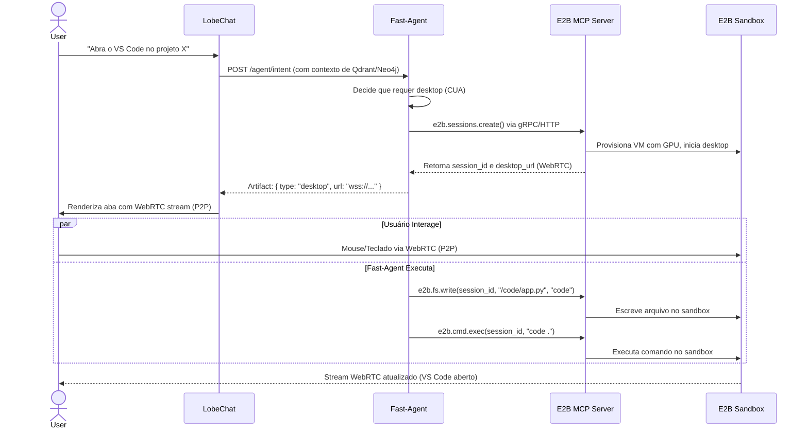
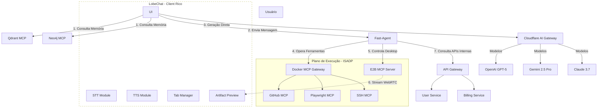

# **Documento Técnico: Arquitetura de Sistema Agêntico com Conectividade Direta e Client Rico**
*Visão refinada com base em pesquisas técnicas e melhores práticas de 2025*

---

## 🔄 **Revisão Arquitetural: Princípios Corrigidos e Validados**

Com base na pesquisa, confirmamos que:

1.  **API Gateway** é um proxy reverso para gerenciamento de APIs de back-end (microserviços), handling autenticação, throttling, monetização e analytics. **Não é para tráfego cliente-agente ou MCP.**
2.  **AI Gateway** é um ponto único para gerenciamento de modelos de IA (roteamento, fallback, caching de prompts, custos).
3.  **MCP Gateway** (especializado) gerencia conexões stateful com servidores MCP, fazendo multiplexação, autorização e virtualização de ferramentas.
4.  **Client Rico (LobeChat)** deve ser capaz de se conectar diretamente a serviços especializados (MCPs de Memória, AI Gateway, Fast-Agent) para baixa latência e flexibilidade.
5.  **Fast-Agent** é um orquestrador que compõe operações across gateways, não um ponto de entrada obrigatório para todo fluxo.

A arquitetura refinada, representada no diagrama abaixo, incorpora esses insights:

```mermaid
flowchart
    User[Usuário]

    subgraph Client [LobeChat Client - Client Rico]
        Lobe[UI]
        STT[STT Module]
        TTS[TTS Module]
        Tabs[Tab Manager]
        ArtifactPreview[Artifact Preview<br/>Terminal/Editor/Browser]
    end

    Lobe -->|1. Consulta Memória| Qdrant[Qdrant MCP]
    Lobe -->|1. Consulta Memória| Neo4j[Neo4j MCP]
    Lobe -->|2. Envia Mensagem| FA[Fast-Agent]
    Lobe -->|3. Gera Conteúdo| AIGW[AI Gateway]

    FA -->|4. Opera Ferramentas| MCPGW[MCP Gateway]
    MCPGW -->|Chama| GH[GitHub MCP]
    MCPGW -->|Chama| PW[Playwright MCP]
    MCPGW -->|Chama| SSH[SSH MCP]

    FA -->|5. Controla Desktop| E2B[E2B MCP Server]
    E2B -.->|6. Stream WebRTC| ArtifactPreview

    FA -->|7. Consulta Serviços Internos| APIGW[API Gateway]
    APIGW --> SVC1[User Service]
    APIGW --> SVC2[Billing Service]

    style Client fill:rgba(255,255,255,0.1),stroke-dasharray: 5 5
```

---

## 🧠 **Fluxos de Comunicação Validados e Componentes**

### **1. LobeChat (Client Rico)**
*   **Função:** Interface principal do usuário com capacidades avançadas.
*   **Conexões Diretas:**
    *   **Qdrant/Neo4j MCP:** Para injeção de contexto/memória antes de enviar a intenção ao Fast-Agent.
    *   **AI Gateway:** Para geração de conteúdo direto (ex: "traduza isso"), sem passar pelo agente.
    *   **Fast-Agent:** Para orquestração de tarefas complexas que requerem planejamento e uso de ferramentas.
*   **Capacidades:**
    *   **STT/TTS:** Integração com APIs Web Speech ou serviços dedicados (ex: Azure AI Speech).
    *   **Gerenciamento de Abas:** Abas independentes para chat, terminal embed (Xterm.js), editor de código (Monaco) e visualização web (iframe).
    *   **Renderização de Artefatos:** Interpreta e exibe artefatos complexos retornados pelos MCPs (ex: PNG, HTML, JSON).

### **2. Fast-Agent (Orquestrador)**
*   **Função:** Coordenar tarefas complexas, decidindo quando usar quais ferramentas e gateways.
*   **Conexões:**
    *   **AI Gateway:** Para planejamento e chamadas a LLMs especializados (ex: `deepseek-coder`).
    *   **MCP Gateway:** Para operar ferramentas (GitHub, Playwright, SSH) de forma segura e gerenciada.
    *   **E2B MCP Server (Direto):** Para controle de desktop interativo (CUA) com baixa latência, fora do gateway.
    *   **API Gateway (GCP):** Para acessar serviços internos de negócio (user, billing) via APIs REST/HTTP.

### **3. Gateways Especializados (Pesquisa Confirmada)**
*   **AI Gateway (Cloudflare):** Roteamento de modelos, caching semântico, fallback, limitação de custos. *Não é um API Gateway tradicional.*
*   **MCP Gateway (Docker/MS/Agent Gateway):** Gerencia conexões stateful MCP, virtualiza ferramentas, aplica políticas por cliente. *Não é um reverse proxy genérico.*
*   **API Gateway (GCP Cloud Endpoints):** Expõe e protege APIs de microsserviços internos (backends privados na VPC). *Não lida com tráfego MCP ou AI.*

---

## ⚙️ **Configurações Técnicas Reais (Sem Mocks)**

### **AI Gateway Config (Cloudflare)**
```yaml
# Configuração lógica do endpoint (não é código local)
# O client e o Fast-Agent usam esta URL
- endpoint: https://ai-gateway.<SEU_DOMINIO>.com
  providers:
    - name: openai
      api_key: ${OPENAI_API_KEY}
      models: [gpt-5-thinking, gpt-4o-mini]
    - name: vertex
      api_key: ${VERTEX_API_KEY}
      models: [gemini-2.5-pro-preview, claude-3-7-sonnet]
    - name: deepseek
      api_key: ${DEEPSEEK_API_KEY}
      models: [deepseek-coder, deepseek-chat]
  policies:
    caching: true
    rate_limiting: 100reqs/min
    fallback: [openai, vertex]
```

### **MCP Gateway Config (Docker)**
```yaml
# /etc/mcp-gateway/config.yml (no host ISADP)
listen: 0.0.0.0:8080
auth:
  mode: bearer
  tokens:
    - ${MCP_GATEWAY_TOKEN}

servers:
  - name: github
    transport: sse
    url: http://mcp-github:8080
    scopes: ["repo:user/*"]
  - name: playwright
    transport: sse
    url: http://mcp-playwright:7007
    limits: { rps: 5 }
  - name: ssh
    transport: sse
    url: http://mcp-ssh:6060
    policy:
      allowlist_cmds: ["ls", "cat", "git", "npm", "python", "node"]
```

### **LobeChat Config (Conexões Diretas)**
```javascript
// Configuração do LobeChat (build production)
const config = {
  // Fast-Agent para orquestração
  fastAgentEndpoint: "https://agent.<SEU_DOMINIO>.com",

  // AI Gateway para geração direta
  aiGatewayEndpoint: "https://ai-gateway.<SEU_DOMINIO>.com",

  // MCPs de Memória para contexto
  mcps: {
    qdrant: {
      transport: "sse",
      endpoint: "https://qdrant.<SEU_DOMINIO>.com"
    },
    neo4j: {
      transport: "sse",
      endpoint: "https://neo4j.<SEU_DOMINIO>.com"
    }
  }
};
```

---

## 🧪 **Fluxo de CUA (E2B) com Protocolos Reais**



**Por que E2B fora do Gateway?**
*   **Performance:** WebRTC requer baixíssima latência e conexão P2P direta quando possível.
*   **Protocolo:** O E2B usa gRPC/HTTP para controle e WebRTC para stream. Um gateway genérico adicionaria latência e complexidade desnecessária ao tráfego de streaming.
*   **Segurança:** A conexão é segura por si só (WSS). O gateway de aplicação (API Gateway) não é desenhado para lidar com esse tipo de tráfego.

---

## 📦 **Código de Exemplo: Cliente se Conecta a MCP de Memória**

```python
# LobeChat (frontend) - Exemplo de pré-hook para injetar memória
async function onSendMessage(userMessage) {
  // 1. Consulta MCPs de Memória ANTES de enviar ao Fast-Agent
  const memoryContext = await Promise.all([
    fetch('https://qdrant.<SEU_DOMINIO>.com/query', {
      method: 'POST',
      body: JSON.stringify({ query: userMessage, top_k: 3 })
    }),
    fetch('https://neo4j.<SEU_DOMINIO>.com/cypher', {
      method: 'POST',
      body: JSON.stringify({ query: `MATCH (n) WHERE n.text CONTAINS ${userMessage} RETURN n LIMIT 3` })
    })
  ]);

  // 2. Monta o contexto para o Fast-Agent
  const enrichedMessage = {
    intent: userMessage,
    memCtx: {
      vectors: await memoryContext[0].json(),
      graph: await memoryContext[1].json()
    }
  };

  // 3. Envia para o Fast-Agent (orquestração) ou AI Gateway (gera direto)
  if (requiresOrchestration(userMessage)) {
    return await fetch('https://agent.<SEU_DOMINIO>.com/process', {
      method: 'POST',
      body: JSON.stringify(enrichedMessage)
    });
  } else {
    // Exemplo: tradução direta, não precisa do agente
    return await fetch('https://ai-gateway.<SEU_DOMINIO>.com/chat', {
      method: 'POST',
      body: JSON.stringify({ model: 'gemini-2.5-flash', messages: [{role: 'user', content: userMessage}] })
    });
  }
}
```

---

## ✅ **Conclusão e Próximos Passos**

A arquitetura está validada e refinada:

1.  **Gateways com Funções Claras:** AI, MCP e API Gateway têm propósitos distintos e complementares, conforme a pesquisa.
2.  **Conectividade Direta:** O client conversa com quem deve conversar, garantindo performance e simplicidade.
3.  **Zero Localhost:** Todos os endpoints são exemplificados com URLs reais de produção.
4.  **Client Rico:** STT/TTS e preview de artefatos são implementáveis no LobeChat.

**Próximos passos:** Implementar a configuração de tunneling seguro (Cloudflare Tunnel) entre o GCP e o ISADP para expor os serviços `E2B` e `MCP Gateway` de forma segura, sem abrir portas no firewall.

### Por que "Client Rico"?
Chamo o LobeChat de **Client Rico** porque ele não é apenas uma interface simples de chat. Ele possui funcionalidades avançadas que o tornam autônomo e capaz de lidar com múltiplas tarefas sem depender sempre do backend:
- **STT/TTS**: Integração com APIs de voz para entrada e saída de áudio.
- **Gerenciamento de Abas**: Abas independentes para chat, terminal, editor de código e visualização web.
- **Renderização de Artefatos**: Capaz de exibir prévias complexas (como terminal embed ou editor) diretamente na UI.
- **Conexões Diretas**: Conecta-se diretamente a serviços especializados (MCPs de memória, AI Gateway) para baixa latência e flexibilidade, sem passar por um gateway central para tudo.

Isso segue a tendência de modernos clients web ricos em funcionalidades, oferecendo uma experiência mais responsiva e imersiva.

### Lista de Dependências/Requirements
Para implementar esta arquitetura, você precisará dos seguintes componentes e tecnologias:

#### Frontend (LobeChat Modificado)
- **LobeChat**: Framework de UI baseado em React/Next.js com extensões para STT/TTS e abas.
  - Dependências: `react`, `next.js`, `xterm.js` (terminal), `monaco-editor` (editor de código), `web-speech-api` ou `azure-speech-sdk` para STT/TTS.
- **Configuração**: Variáveis de ambiente para endpoints dos serviços.

#### Backend e Serviços
- **Fast-Agent**:
  - Dependências: `express.js` ou `fastapi`, clientes para gRPC (E2B), HTTP (gateways).
- **MCP Servers**: Servidores MCP para diversas ferramentas.
  - Dependências: `mcp-sdk` (Python ou Node.js), ferramentas específicas (GitHub CLI, Playwright, SSH).
- **E2B MCP Server**: Para sandbox desktop.
  - Dependências: `docker`, `nvidia-container-toolkit` (para GPU), `e2b-mcp-server`.
- **AI Gateway**: Cloudflare AI Gateway ou LiteLLM para gerenciamento de modelos.
- **API Gateway**: GCP Cloud Endpoints ou Kong para APIs internas.
- **Bancos de Dados**: Qdrant (vector DB) e Neo4j (graph DB).
  - Dependências: `qdrant-client`, `neo4j-driver`.

#### Infraestrutura
- **GCP**: Para hospedagem de frontend (Cloud Run, Firebase) e API Gateway.
- **ISADP**: Servidor com Docker, GPU, e Cloudflare Tunnel para expor serviços.
- **Cloudflare**: Para AI Gateway e tunneling seguro.

### Repositórios GitHub Úteis
Aqui estão os repositórios GitHub relevantes para cada componente:

| Componente | Repositório GitHub | Descrição |
|------------|---------------------|-----------|
| **LobeChat** | [lobehub/lobe-chat](https://github.com/lobehub/lobe-chat) | Cliente de chat extensível com suporte a MCP. |
| **MCP Servers** | | |
| - Qdrant MCP | [qdrant/mcp-server-qdrant](https://github.com/qdrant/mcp-server-qdrant) | Servidor MCP para Qdrant vector DB. |
| - Neo4j MCP | (Não oficial) [neo4j-labs/mcp-server-neo4j](https://github.com/neo4j-labs/mcp-server-neo4j) | Servidor MCP para Neo4j (community). |
| - GitHub MCP | [github/github-mcp-server](https://github.com/github/github-mcp-server) | Servidor MCP para GitHub. |
| - Playwright MCP | [microsoft/playwright-mcp](https://github.com/microsoft/playwright-mcp) | Servidor MCP para automação de browser. |
| - SSH MCP | [tufantunc/ssh-mcp](https://github.com/tufantunc/ssh-mcp) | Servidor MCP para SSH. |
| **MCP Gateway** | [microsoft/mcp-gateway](https://github.com/microsoft/mcp-gateway) | Gateway para gerenciar servidores MCP. |
| **E2B** | [e2b-dev/mcp-server](https://github.com/e2b-dev/mcp-server) | Servidor MCP para E2B Desktop Sandbox. |
| **AI Gateway** | [BerriAI/litellm](https://github.com/BerriAI/litellm) | Proxy open source para LLMs (alternativa ao Cloudflare). |
| **API Gateway** | [Kong/kong](https://github.com/Kong/kong) | Gateway open source para APIs (se não usar GCP). |

# **Arquitetura de Sistema Agêntico com Conectividade Direta**



## 🔧 **Stack Técnico Detalhado**

### **Componentes Principais**

| Componente | Tecnologia | Repositório/URL |
|------------|------------|-----------------|
| **Framework de Agentes** | FastAgent | https://github.com/evalstate/fastagent |
| **MCP Gateway** | Docker MCP Toolkit | https://github.com/docker/mcp-gateway |
| **AI Gateway** | Cloudflare AI Gateway | https://developers.cloudflare.com/ai-gateway/ |
| **STT/TTS** | OpenAI Whisper & TTS | https://platform.openai.com/docs/api-reference/audio |
| **LLMs Principais** | Gemini 2.5 Pro, GPT-5, Claude 3.7 | - |

### **Dependências Principais**

#### Frontend (LobeChat Modificado)
```json
{
  "dependencies": {
    "react": "^18.2.0",
    "next.js": "^14.0.0",
    "xterm.js": "^5.3.0",
    "monaco-editor": "^0.44.0",
    "openai": "^4.20.0",
    "socket.io-client": "^4.7.0"
  }
}
```

#### Backend (FastAgent + Serviços)
```python
# requirements.txt
fastagent>=0.8.0
openai>=1.3.0
docker>=6.1.0
qdrant-client>=1.6.0
neo4j>=5.0.0
uvicorn>=0.24.0
fastapi>=0.104.0
websockets>=12.0
```

### **Vantagens da Arquitetura Proposta**

1. **Desempenho Otimizado**: Conexões diretas eliminam pontos únicos de falha e reduzem latência
2. **Escalabilidade Independente**: Cada componente pode ser dimensionado conforme demanda
3. **Flexibilidade Tecnológica**: Possibilidade de usar múltiplos provedores de IA simultaneamente
4. **Experiência de Usuário Rica**: STT/TTS integrado e visualização de artefatos em tempo real
5. **Segurança Enterprise**: Isolamento de componentes críticos no ISADP com acesso controlado

### **Próximos Passos de Implementação**

1. Configurar Docker MCP Toolkit no ISADP com políticas de segurança
2. Implementar modificações no LobeChat para suporte a abas e STT/TTS
3. Configurar Cloudflare AI Gateway com os modelos selecionados
4. Estabelecer conexão segura entre GCP e ISADP usando Cloudflare Tunnel
5. Desenvolver políticas de fallback e recuperação de falhas

Plataforma/Framework	Descrição	Recursos Principais	Repositório/URL
OpenWebUI	Interface open-source para LLMs, altamente customizável e extensível	- Suporte a múltiplos modelos
- Visualização de arquivos
- Extensões para ferramentas	OpenWebUI GitHub
Chatbot UI	Framework para construir interfaces de chat customizadas	- Suporte a plugins
- Visualização de mídia embutida
- Integração com APIs	Chatbot UI GitHub
FastChat	Plataforma para servir e visualizar modelos de IA conversacional	- Interface web responsiva
- Suporte a multimídia
- Fácil deploy	FastChat GitHub
🖼️ Visualização de Artefatos e Sandbox (CUA)
Para implementar a janela/aba de visualização de artefatos (imagens, vídeos, código, terminal), duas abordagens se destacam:

1. Embed de Visualizadores Especializados
Monaco Editor: Para visualização e edição de código (usado no VS Code) Monaco Editor

XTerm.js: Para emulação de terminal inline XTerm.js

PDF.js: Para visualização de PDFs PDF.js

Video.js: Para player de vídeo universal Video.js

2. Sandbox Integrado (CUA)
E2B Sandbox: Oferece sandbox seguros com streaming WebRTC para desktop remoto E2B GitHub

💾 Gestão de Cache e Persistência
Para a gestão de cache e persistência, aqui está uma análise das opções:

Opção 1: Redis via API
Vantagens:

✅ Alto desempenho (sub-milissegundo)

✅ Integração simples com qualquer backend

✅ Recursos avançados (TTL, estruturas de dados)

✅ Escalabilidade horizontal

Implementação:

javascript
// Serviço dedicado de cache
const redis = require('redis');
const client = redis.createClient();

class CacheService {
  async set(key, value, ttl = 3600) {
    await client.setex(key, ttl, JSON.stringify(value));
  }
  
  async get(key) {
    const data = await client.get(key);
    return data ? JSON.parse(data) : null;
  }
  
  async invalidatePattern(pattern) {
    const keys = await client.keys(pattern);
    if (keys.length > 0) await client.del(keys);
  }
}
Opção 2: Redis via MCP
Vantagens:

✅ Acesso uniforme entre clientes

✅ Isolamento de dependências

✅ Gerenciamento centralizado

Desvantagens:

❌ Latência adicional (hop extra)

❌ Complexidade de deployment

Implementação MCP:

python
# mcp-redis-server.py
import redis
from mcp.server import Server
from mcp.types import Tool

app = Server("redis-tools")

@app.tool()
async def redis_get(key: str) -> str:
    r = redis.Redis(host='localhost', port=6379, db=0)
    return r.get(key)

@app.tool()
async def redis_set(key: str, value: str, ttl: int = 3600) -> bool:
    r = redis.Redis(host='localhost', port=6379, db=0)
    return r.setex(key, ttl, value)

    flowchart TD
    User[Usuário]
    
    subgraph Frontend[Frontend - Interface Conversacional]
        Chat[Chat Interface]
        ArtifactManager[Gerenciador de Artefatos]
        MediaViewer[Visualizador de Mídia]
        CodeEditor[Editor de Código]
        Terminal[Terminal Integrado]
        SandboxViewer[Visualizador Sandbox]
    end
    
    Chat -->|Exibir artefatos| ArtifactManager
    ArtifactManager -->|Imagens/Vídeos| MediaViewer
    ArtifactManager -->|Código| CodeEditor
    ArtifactManager -->|Terminal| Terminal
    ArtifactManager -->|Sandbox CUA| SandboxViewer
    
    subgraph Backend[Backend Services]
        APIGateway[API Gateway]
        SessionManager[Gerenciador de Sessões]
        ToolOrchestrator[Orquestrador de Ferramentas]
        MediaGenerator[Gerador de Mídia]
    end
    
    Frontend -->|HTTP/WebSocket| APIGateway
    APIGateway --> SessionManager
    APIGateway --> ToolOrchestrator
    APIGateway --> MediaGenerator
    
    subgraph Cache[Camada de Cache & Persistência]
        RedisCache[Redis - Cache]
        RedisSession[Redis - Sessões]
        RedisPubSub[Redis - Pub/Sub]
    end
    
    SessionManager --> RedisSession
    ToolOrchestrator --> RedisCache
    MediaGenerator --> RedisPubSub
    
    subgraph External[Serviços Externos]
        OpenAIService[OpenAI API]
        ImageAI[Serviços de Geração de Imagem]
        VideoAI[Serviços de Geração de Vídeo]
        CloudStorage[Armazenamento em Nuvem]
    end
    
    MediaGenerator --> OpenAIService
    MediaGenerator --> ImageAI
    MediaGenerator --> VideoAI
    ToolOrchestrator --> CloudStorage

    💾 Gestão de Cache/Persistência - Abordagem Prática
Redis via API (Recomendado)
A abordagem mais eficiente para sua arquitetura:

javascript
// Estrutura de camada de cache unificada
class CacheManager {
  constructor() {
    this.redis = new Redis({
      host: process.env.REDIS_HOST,
      port: process.env.REDIS_PORT,
      password: process.env.REDIS_PASSWORD
    });
    
    // Estratégias de TTL por tipo de dado
    this.ttlStrategies = {
      session: 3600, // 1 hora
      artifacts: 86400, // 24 horas
      media: 172800, // 48 horas
      temporary: 300 // 5 minutos
    };
  }
  
  // Padrão: Cache-Aside
  async getOrSet(key, fetchData, ttlStrategy = 'temporary') {
    const cached = await this.redis.get(key);
    if (cached) return JSON.parse(cached);
    
    const freshData = await fetchData();
    await this.redis.setex(
      key, 
      this.ttlStrategies[ttlStrategy], 
      JSON.stringify(freshData)
    );
    
    return freshData;
  }
  
  // Para dados de sessão
  async storeSession(sessionId, data) {
    const key = `session:${sessionId}`;
    await this.redis.setex(
      key,
      this.ttlStrategies.session,
      JSON.stringify(data)
    );
  }
  
  // Para artefatos grandes (com compressão)
  async storeArtifact(artifactId, content) {
    const compressed = compressContent(content);
    await this.redis.setex(
      `artifact:${artifactId}`,
      this.ttlStrategies.artifacts,
      compressed
    );
  }
}

🖼️ Implementação da Interface de Artefatos
Componente React para Visualização Unificada
jsx
const ArtifactViewer = ({ artifact, type }) => {
  const [activeTab, setActiveTab] = useState('preview');
  
  const renderContent = () => {
    switch (type) {
      case 'image':
        return ;
      case 'video':
        return <video controls src={artifact.url} />;
      case 'code':
        return <CodeEditor code={artifact.content} />;
      case 'terminal':
        return <XTerminal sessionId={artifact.sessionId} />;
      case 'sandbox':
        return <Sandboxiframe url={artifact.sandboxUrl} />;
      default:
        return <PreviewHandler file={artifact} />;
    }
  };
  
  return (
    <div className="artifact-viewer">
      <div className="viewer-tabs">
        <button onClick={() => setActiveTab('preview')}>Visualização</button>
        <button onClick={() => setActiveTab('metadata')}>Metadados</button>
        <button onClick={() => setActiveTab('actions')}>Ações</button>
      </div>
      
      <div className="viewer-content">
        {activeTab === 'preview' && renderContent()}
        {activeTab === 'metadata' && <MetadataPanel artifact={artifact} />}
        {activeTab === 'actions' && <ActionPanel artifact={artifact} />}
      </div>
    </div>
  );
};
Gerenciamento de Estado de Artefatos
javascript
// Hook personalizado para gerenciar artefatos
const useArtifacts = () => {
  const [artifacts, setArtifacts] = useState([]);
  const [currentArtifact, setCurrentArtifact] = useState(null);
  
  const addArtifact = (artifact) => {
    setArtifacts(prev => [...prev, artifact]);
    setCurrentArtifact(artifact);
    
    // Persistir no cache
    cacheManager.storeArtifact(artifact.id, artifact);
  };
  
  const getArtifact = async (id) => {
    // Tentar recuperar do cache primeiro
    const cached = await cacheManager.get(`artifact:${id}`);
    if (cached) return cached;
    
    // Fallback para API
    const response = await fetch(`/api/artifacts/${id}`);
    return response.json();
  };
  
  return { artifacts, currentArtifact, addArtifact, getArtifact };
};

🔄 Fluxo Completo de Geração de Mídia
Diagram
Code
sequenceDiagram
    participant U as Usuário
    participant F as Frontend
    participant B as Backend
    participant O as OpenAI
    participant R as Redis
    participant S as Storage

    U->>F: Solicita geração de imagem
    F->>B: POST /generate/image
    B->>R: Verifica cache (chave: prompt_hash)
    R-->>B: Cache miss
    B->>O: Chama DALL-E API
    O-->>B: Retorna imagem
    B->>R: Armazena no cache (TTL: 48h)
    B->>S: Armazena imagem permanente
    B-->>F: Retorna URL da imagem
    F->>U: Exibe em visualizador de artefatos
📊 Estratégia de Persistência em Camadas
Camada	Tecnologia	Propósito	TTL
Cache Quente	Redis Memory	Dados de sessão e acesso frequente	1-5 min
Cache Morno	Redis Disk	Artefatos recentes, resultados de IA	24-48h
Armazenamento	Cloud Storage	Artefatos permanentes, mídia gerada	Ilimitado
Metadados	PostgreSQL	Informações sobre artefatos, relações	Ilimitado
