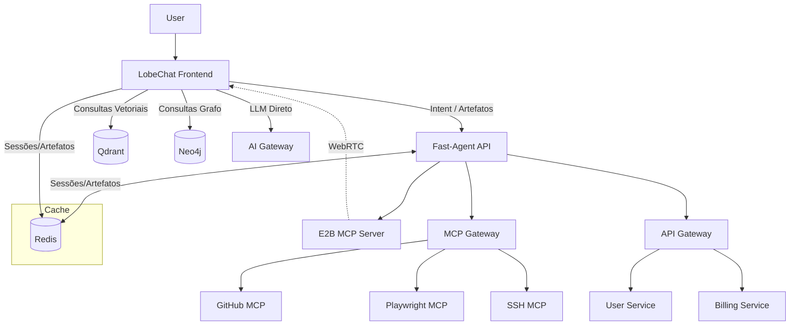
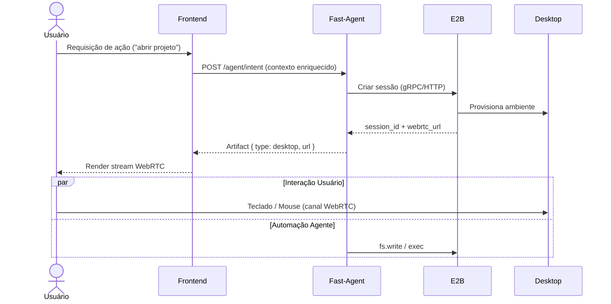

# Project CUA – Arquitetura Técnica

> Documento de referência unificado. Mantido em versão curta e objetiva; detalhes operacionais ficam no playbook (`.github/copilot-instructions.md`).

---

## 1. Visão Geral

Plataforma de agente conversacional com capacidades de execução (CUA) combinando:

- Frontend rico (LobeChat modificado) com abas de artefatos (código, terminal, mídia, sandbox desktop E2B)
- Backend orquestrador (FastAgent / FastAPI)
- Gateways especializados: AI Gateway (Cloudflare), MCP Gateway (Docker), API Gateway (serviços internos)
- Ferramentas via servidores MCP (GitHub, Playwright, SSH, Qdrant, Neo4j, E2B)

Objetivo: baixa latência, execução segura, extensibilidade rápida de ferramentas e visualização unificada de artefatos.

---

## 2. Diagramas

### 2.1 Fluxo Alto Nível



### 2.2 Sessão CUA (Desktop)



---

## 3. Componentes

| Componente | Responsabilidade | Stack / Tecnologias | Observações |
|------------|------------------|---------------------|-------------|
| Frontend (LobeChat) | UI, abas, STT/TTS, render artefatos | React/Next.js, Zustand, XTerm.js, Monaco | Conexões diretas a AI Gateway & bancos |
| Fast-Agent | Orquestração, tool routing, planejamento | FastAPI, Python, asyncio | Expõe endpoints intents & artifacts |
| MCP Gateway | Multiplexação de servidores MCP | Docker MCP Gateway | Latência baixa, SSE/WS |
| MCP Servers | Ferramentas individuais | GitHub, Playwright, SSH, Qdrant, Neo4j, E2B | Reuso antes de criar novos |
| AI Gateway | Roteamento LLM, caching, fallback | Cloudflare AI Gateway | Abstrai provedores (OpenAI, Gemini, Claude) |
| API Gateway | Serviços internos | GCP Endpoints ou Kong | Apenas microserviços internos |
| Redis | Sessões / cache / artefatos leves | Redis 7 TLS | Cache-aside pattern |
| Qdrant | Vetores contextuais | Qdrant | Memória semântica |
| Neo4j | Grafo de relações | Neo4j | Contexto estrutural |
| E2B | Sandbox desktop remoto | E2B MCP | WebRTC + gRPC |

---

## 4. Fluxos Críticos

### 4.1 Envio de Mensagem com Contexto

1. UI coleta input
2. Consulta Qdrant (similaridade) e Neo4j (subgrafo relevante)
3. Agrega contexto → Intent
4. Decide: chamada direta ao AI Gateway (se simples) ou Fast-Agent (se precisa ferramentas)
5. Fast-Agent: planeja → decide uso de MCPs / E2B → retorna artefatos incrementais

### 4.2 Execução de Ferramenta (via MCP)

1. Fast-Agent chama MCP Gateway → request tool
2. MCP Gateway encaminha para servidor específico
3. Resposta normalizada volta ao agente
4. Agente transforma resultado em artifact (JSON, código, imagem)
5. Frontend atualiza painel de artefatos

### 4.3 Cache & Sessão

- Padrão cache-aside
- Chaves prefixadas: `sess:`, `artf:`, `vec:`, `graph:`, `plan:`
- TTLs sugeridos: sessão 1h, artefato 24-48h, planos 5m

---

## 5. Modelos de Dados (Esboço)

```yaml
Artifact:
  id: string
  type: enum(code|terminal|media|sandbox|text)
  label: string
  mime?: string
  content_ref?: string   # pointer (S3, object store)
  inline_data?: string   # base64 / text
  created_at: timestamp
  meta: { source: string, tool?: string }

Session:
  id: string
  user_id: string
  created_at: timestamp
  last_active: timestamp
  artifacts: [artifact_id]
  state: { active_tab: string, context_window: int }
```

---

## 6. Padrões de Código

### Frontend

- Hooks: `useArtifacts`, `useCUA`, `useSTT`
- Estado global: Zustand slices (artifacts, session, ui)
- Comunicação: fetch/stream via SSE ou WebSocket quando necessário

### Backend

- Arquitetura: `app/core`, `app/routes`, `app/services`, `app/models`
- Tool Executor centraliza chamadas MCP
- Cache Manager expõe `get_or_set(key, coro, ttl)`

---

## 7. Segurança

| Área | Medida | Notas |
|------|--------|-------|
| Segredos | GCP Secret Manager | Nunca em repositório |
| Transporte | TLS em todos endpoints externos | Certificados gerenciados |
| AutN | JWT curto + refresh server-side | Scope per tool futura |
| AutZ | Limitação por tool + rate limit gateway | MCP policies |
| Desktop | Sessões E2B isoladas | Expirar inativas |
| Logging | Sem conteúdo sensível | Redact keys |

---

## 8. Observabilidade (Fase Posterior)

- Logging estruturado JSON (campos: trace_id, session_id, tool, latency_ms)
- Métricas: request_count, tool_latency_bucket, active_sessions
- Tracing: introduzir OpenTelemetry depois de MVP

---

## 9. Planos de Escala

| Dimensão | Estratégia Inicial | Evolução |
|----------|--------------------|----------|
| Frontend | Edge caching static | Code splitting avançado |
| Backend | Gunicorn/Uvicorn workers | Sharding por tenant |
| Vetores | Qdrant single node | Cluster Qdrant + HNSW tune |
| Grafo | Neo4j single | Aura cluster |
| Redis | Single w/ AOF | Sentinel / Cluster |
| E2B | Pool inicial 2-3 VMs | Autoscaling por fila |

---

## 10. Risks & Mitigações

| Risco | Impacto | Mitigação |
|-------|---------|-----------|
| Latência WebRTC alta | UX prejudicada | Seleção de região próxima / TURN otimizado |
| Explosão de custo LLM | Orçamento | Caching + modelos menores para pré-raciocínio |
| Ferramenta MCP instável | Fluxo interrompido | Health check periódico + fallback |
| Crescimento artefatos | Armazenamento caro | Expurgo + offload S3 + compressão |

---

## 11. Roadmap Técnico (Resumo Próximo Sprint)

1. Scaffold backend (FastAPI) + health + intent stub
2. Scaffold frontend base + provider Zustand + viewer placeholder
3. Redis CacheManager + integração artifacts
4. ToolExecutor abstração + mock MCP call
5. Qdrant + Neo4j client wrappers (interfaces)
6. E2B sessão bootstrap (simulado)
7. AI Gateway client wrapper
8. Test baseline + CI script unificado

---

## 12. Glossário

| Termo | Definição |
|-------|----------|
| Artifact | Unidade de saída exibida na UI (código, imagem, texto, terminal) |
| CUA | Computer User Assistance (controle de ambiente/sandbox) |
| MCP | Model Context Protocol: padroniza interação com ferramentas |
| Tool | Ação invocável via MCP (ex: git.commit, browser.click) |

---

## 13. Versionamento & Qualidade

- SemVer
- Gate de merge: build + lint + testes verdes
- Cobertura mínima backend 70% linhas críticas; frontend smoke + componentes chave

---

**Última revisão:** (preencher)

---

Manter este documento sincronizado com mudanças arquiteturais relevantes.
