# 🏗️ Project CUA – Advanced Technical Architecture

> **Comprehensive technical reference for the Computer User Assistance platform**  
> *Version 0.1.0 • Last updated: $(date +'%Y-%m-%d')*

[](https://github.com/myselfgus/cua)
[](README.md)
[](#interactive-diagrams)

---

## 📋 Table of Contents

<details>
<summary>🧭 Click to expand navigation</summary>

- [🎯 Executive Summary](#-executive-summary)
- [🏗️ System Architecture Overview](#️-system-architecture-overview)
- [🔧 Component Deep Dive](#-component-deep-dive)
- [📊 Interactive Diagrams](#-interactive-diagrams)
- [🔄 Critical Data Flows](#-critical-data-flows)
- [🗄️ Data Models & Schemas](#️-data-models--schemas)
- [📐 Design Patterns & Principles](#-design-patterns--principles)
- [🔒 Security Architecture](#-security-architecture)
- [📈 Performance & Scalability](#-performance--scalability)
- [🚨 Error Handling & Resilience](#-error-handling--resilience)
- [📊 Observability & Monitoring](#-observability--monitoring)
- [🎯 Technology Decision Matrix](#-technology-decision-matrix)
- [🚀 Future Architecture Evolution](#-future-architecture-evolution)
- [📖 Glossary & References](#-glossary--references)

</details>

---

## 🎯 Executive Summary

Project CUA implements a **multi-layered agent architecture** designed for:

- 🎯 **Rich User Experience**: Unified interface for code, terminal, media, and sandbox interactions
- ⚡ **Low Latency**: Direct client connections to specialized services (< 200ms response times)
- 🔧 **Tool Extensibility**: MCP-based tool ecosystem with hot-swappable capabilities
- 🔒 **Secure Execution**: Isolated sandbox environments with controlled resource access
- 📈 **Horizontal Scalability**: Cloud-native components with auto-scaling capabilities

### Key Architectural Decisions

| Decision | Rationale | Trade-offs |
|----------|-----------|------------|
| **Client-Rico Pattern** | Reduces latency, improves responsiveness | Increased frontend complexity |
| **MCP Tool Protocol** | Standardized, extensible tool integration | Protocol overhead, version compatibility |
| **Multi-Gateway Pattern** | Specialized routing, better performance | Infrastructure complexity |
| **Direct Database Access** | Lower latency for context retrieval | Tighter coupling, security considerations |
| **E2B Sandbox Integration** | Secure code execution, GPU access | Cost implications, latency for remote execution |

---

## 🏗️ System Architecture Overview

### High-Level Architecture

```mermaid
graph TB
    subgraph "🌐 Client Layer"
        UI[🖥️ LobeChat Frontend<br/>React/Next.js]
        STT[🎤 Speech-to-Text<br/>Real-time transcription]
        TTS[🔊 Text-to-Speech<br/>Audio synthesis]
        AV[📱 Artifact Viewer<br/>Multi-tab interface]
    end

    subgraph "🚪 Gateway Layer"
        AG[🤖 AI Gateway<br/>Cloudflare/LiteLLM]
        MG[🔌 MCP Gateway<br/>Docker orchestration]
        API[🌐 API Gateway<br/>GCP Load Balancer]
    end

    subgraph "🧠 Orchestration Layer"
        FA[⚡ FastAgent<br/>Python/FastAPI]
        TE[🛠️ Tool Executor<br/>MCP coordination]
        CM[💾 Cache Manager<br/>Redis abstraction]
        IR[🧭 Intent Router<br/>Request routing]
    end

    subgraph "🔧 Tool Layer"
        GH[📝 GitHub MCP<br/>Repository operations]
        PW[🌐 Playwright MCP<br/>Browser automation]
        SSH[🖥️ SSH MCP<br/>Remote access]
        E2B[📦 E2B Sandbox<br/>Code execution]
    end

    subgraph "🗄️ Data Layer"
        Redis[(🚀 Redis<br/>Sessions & Cache)]
        Qdrant[(🔍 Qdrant<br/>Vector similarity)]
        Neo4j[(🕸️ Neo4j<br/>Knowledge graph)]
        Storage[(📦 Cloud Storage<br/>Artifacts & media)]
    end

    %% Direct connections for low latency
    UI --> Qdrant
    UI --> Neo4j
    UI --> AG
    UI --> API
    
    %% Orchestration flow
    UI --> FA
    FA --> IR
    IR --> TE
    TE --> MG
    FA --> CM
    CM --> Redis
    
    %% Tool execution
    MG --> GH
    MG --> PW
    MG --> SSH
    TE --> E2B
    
    %% Data persistence
    FA --> Storage
    TE --> Redis

    %% Styling
    classDef clientLayer fill:#e1f5fe
    classDef gatewayLayer fill:#f3e5f5
    classDef orchestrationLayer fill:#e8f5e8
    classDef toolLayer fill:#fff3e0
    classDef dataLayer fill:#fce4ec
    
    class UI,STT,TTS,AV clientLayer
    class AG,MG,API gatewayLayer
    class FA,TE,CM,IR orchestrationLayer
    class GH,PW,SSH,E2B toolLayer
    class Redis,Qdrant,Neo4j,Storage dataLayer
```



### Network Architecture


---

## 🔧 Component Deep Dive

### Frontend Components (LobeChat Extended)

<details>
<summary>🎨 Frontend Architecture Details</summary>

#### Core Components Structure

```typescript
// Component hierarchy and responsibilities
interface ComponentArchitecture {
  App: {
    providers: ['ThemeProvider', 'StateProvider', 'ErrorBoundary'];
    layout: 'ResponsiveLayout';
    routing: 'NextRouter';
  };
  
  ChatInterface: {
    components: ['MessageList', 'InputBox', 'ToolResults'];
    hooks: ['useChat', 'useMessages', 'useStreaming'];
    features: ['SSE', 'WebSocket', 'File Upload'];
  };
  
  ArtifactViewer: {
    tabs: ['CodeEditor', 'Terminal', 'MediaViewer', 'WebPreview'];
    editors: ['Monaco', 'XTerm.js', 'ReactPlayer'];
    state: 'Zustand store';
  };
  
  ToolPanels: {
    github: 'GitHubExplorer';
    browser: 'PlaywrightConsole';
    system: 'SSHTerminal';
    sandbox: 'E2BRunner';
  };
}
```

#### State Management Architecture

```typescript
// Zustand store structure
interface AppState {
  // Session management
  session: {
    id: string;
    user: UserProfile;
    preferences: UserPreferences;
    activeConversation: string;
  };
  
  // Artifact management
  artifacts: {
    items: Map<string, Artifact>;
    activeTab: ArtifactType;
    history: ArtifactHistory[];
    cache: LRUCache<string, Artifact>;
  };
  
  // Tool state
  tools: {
    github: GitHubState;
    playwright: BrowserState;
    ssh: SSHState;
    e2b: SandboxState;
  };
  
  // UI state
  ui: {
    theme: 'light' | 'dark' | 'auto';
    layout: LayoutConfiguration;
    notifications: Notification[];
    loading: LoadingState;
  };
}

// Performance optimization patterns
const useArtifacts = () => {
  const artifacts = useAppStore(state => state.artifacts.items);
  const addArtifact = useAppStore(state => state.addArtifact);
  
  // Memoized selectors for performance
  const activeArtifact = useMemo(
    () => artifacts.get(activeId),
    [artifacts, activeId]
  );
  
  // Optimistic updates
  const updateArtifact = useCallback(async (id: string, updates: Partial<Artifact>) => {
    // Optimistic update
    updateArtifactOptimistic(id, updates);
    
    try {
      // Persist to backend
      await api.updateArtifact(id, updates);
    } catch (error) {
      // Rollback on failure
      revertArtifactUpdate(id);
      showError('Failed to update artifact');
    }
  }, []);
  
  return { artifacts, activeArtifact, addArtifact, updateArtifact };
};
```

#### Component Communication Patterns

```typescript
// Event-driven architecture
interface ComponentEvents {
  // Cross-component communication
  'artifact:created': (artifact: Artifact) => void;
  'artifact:updated': (id: string, updates: Partial<Artifact>) => void;
  'tool:executed': (toolName: string, result: ToolResult) => void;
  'session:changed': (sessionId: string) => void;
  
  // System events
  'error:occurred': (error: Error, context: ErrorContext) => void;
  'performance:metric': (metric: PerformanceMetric) => void;
  'user:action': (action: UserAction) => void;
}

// Usage example
const ArtifactViewer: FC<ArtifactViewerProps> = ({ artifactId }) => {
  const { artifact, updateArtifact } = useArtifact(artifactId);
  const eventBus = useEventBus<ComponentEvents>();
  
  useEffect(() => {
    const unsubscribe = eventBus.on('artifact:updated', (id, updates) => {
      if (id === artifactId) {
        // Handle external updates
        updateArtifact(updates);
      }
    });
    
    return unsubscribe;
  }, [artifactId, eventBus, updateArtifact]);
  
  return (
    <div className="artifact-viewer">
      <TabSelector artifact={artifact} />
      <ContentRenderer artifact={artifact} />
    </div>
  );
};
```

</details>

### Backend Components (FastAgent Core)

<details>
<summary>⚙️ Backend Architecture Details</summary>

#### Service Layer Architecture

```python
# Layered architecture implementation
from abc import ABC, abstractmethod
from typing import Protocol, TypeVar, Generic

T = TypeVar('T')

class Repository(Protocol[T]):
    """Repository pattern for data access"""
    async def get(self, id: str) -> T | None: ...
    async def save(self, entity: T) -> T: ...
    async def delete(self, id: str) -> bool: ...
    async def find(self, **criteria) -> list[T]: ...

class Service(ABC):
    """Base service class with common functionality"""
    def __init__(self, repository: Repository, cache: CacheManager):
        self.repository = repository
        self.cache = cache
        self.logger = get_logger(self.__class__.__name__)
    
    async def get_or_cache(self, key: str, factory_fn, ttl: int = 300):
        """Cache-aside pattern implementation"""
        if cached := await self.cache.get(key):
            return cached
        
        value = await factory_fn()
        await self.cache.set(key, value, ttl=ttl)
        return value

class ToolExecutor(Service):
    """Tool execution orchestration"""
    
    def __init__(self, mcp_client: MCPClient, cache: CacheManager):
        super().__init__(None, cache)  # No repository needed
        self.mcp_client = mcp_client
        self.execution_tracker = ExecutionTracker()
    
    async def execute(self, tool_request: ToolRequest) -> ToolResult:
        """Execute tool with comprehensive error handling and monitoring"""
        execution_id = self.execution_tracker.start(tool_request)
        
        try:
            # Validate request
            await self._validate_request(tool_request)
            
            # Check cache for idempotent operations
            if tool_request.idempotent:
                cache_key = self._build_cache_key(tool_request)
                if cached_result := await self.cache.get(cache_key):
                    return ToolResult.from_cache(cached_result)
            
            # Execute tool via MCP
            mcp_response = await self.mcp_client.call_tool(
                tool_request.name,
                tool_request.parameters
            )
            
            # Process response into artifacts
            artifacts = await self._process_response(mcp_response)
            
            # Create result
            result = ToolResult(
                id=execution_id,
                success=True,
                artifacts=artifacts,
                metadata=mcp_response.metadata
            )
            
            # Cache successful results
            if tool_request.idempotent:
                await self.cache.set(cache_key, result, ttl=300)
            
            return result
            
        except Exception as error:
            self.logger.error(f"Tool execution failed: {error}", extra={
                'tool_name': tool_request.name,
                'execution_id': execution_id,
                'error_type': type(error).__name__
            })
            
            return ToolResult(
                id=execution_id,
                success=False,
                error=str(error),
                artifacts=[]
            )
        finally:
            self.execution_tracker.complete(execution_id)
    
    async def _validate_request(self, request: ToolRequest) -> None:
        """Validate tool request parameters and permissions"""
        # Parameter validation
        schema = await self.mcp_client.get_tool_schema(request.name)
        validate_parameters(request.parameters, schema)
        
        # Permission validation
        if not await self._check_permissions(request):
            raise PermissionError(f"Insufficient permissions for {request.name}")
    
    async def _process_response(self, response: MCPResponse) -> list[Artifact]:
        """Transform MCP response into typed artifacts"""
        artifacts = []
        
        for item in response.content:
            if item.type == 'text':
                artifacts.append(TextArtifact(
                    content=item.text,
                    metadata=item.annotations
                ))
            elif item.type == 'image':
                artifacts.append(ImageArtifact(
                    url=item.data,
                    alt_text=item.annotations.get('alt', ''),
                    dimensions=item.annotations.get('dimensions')
                ))
            elif item.type == 'resource':
                artifacts.append(ResourceArtifact(
                    uri=item.uri,
                    mime_type=item.mimeType,
                    metadata=item.annotations
                ))
        
        return artifacts
```

#### Intent Router Implementation

```python
class IntentRouter:
    """Routes user intents to appropriate handlers"""
    
    def __init__(self, handlers: dict[str, IntentHandler]):
        self.handlers = handlers
        self.classifier = IntentClassifier()
        self.metrics = MetricsCollector()
    
    async def route(self, intent: UserIntent) -> IntentResponse:
        """Route intent to appropriate handler with fallback logic"""
        start_time = time.time()
        
        try:
            # Classify intent
            classification = await self.classifier.classify(intent)
            
            # Select handler
            handler = self._select_handler(classification)
            
            # Execute with context
            context = await self._build_context(intent, classification)
            response = await handler.handle(intent, context)
            
            # Record metrics
            duration = time.time() - start_time
            self.metrics.record_intent_handling(
                intent_type=classification.type,
                handler=handler.__class__.__name__,
                duration=duration,
                success=True
            )
            
            return response
            
        except Exception as error:
            # Fallback to general handler
            fallback_handler = self.handlers.get('general')
            if fallback_handler:
                return await fallback_handler.handle(intent, {})
            
            raise IntentHandlingError(f"Failed to handle intent: {error}")
    
    def _select_handler(self, classification: IntentClassification) -> IntentHandler:
        """Select best handler based on classification confidence"""
        if classification.confidence > 0.8:
            return self.handlers[classification.type]
        elif classification.confidence > 0.6:
            # Use multi-handler approach for ambiguous intents
            return CompositeHandler([
                self.handlers[classification.type],
                self.handlers.get('general', NoOpHandler())
            ])
        else:
            return self.handlers['general']
```

</details>

### MCP Gateway & Tool Integration

<details>
<summary>🔌 MCP Architecture & Tool Ecosystem</summary>

#### MCP Gateway Configuration

```yaml
# docker-mcp-gateway/config/gateway.yml
gateway:
  version: "1.0"
  port: 8080
  health_check_interval: 30s
  max_concurrent_connections: 100
  
  routing:
    strategy: "round_robin"  # or "least_connections", "weighted"
    health_check_path: "/health"
    timeout: 30s
    retries: 3
    
  servers:
    github:
      image: "ghcr.io/github/github-mcp-server:latest"
      replicas: 3
      environment:
        GITHUB_TOKEN: "${SECRET_GITHUB_TOKEN}"
        LOG_LEVEL: "info"
      resources:
        cpu: "500m"
        memory: "512Mi"
      capabilities:
        - "github.search_repositories"
        - "github.get_repository"
        - "github.create_issue"
        - "github.list_issues"
        - "github.get_pull_request"
        - "github.create_pull_request"
      
    playwright:
      image: "mcr.microsoft.com/playwright-mcp:latest"
      replicas: 2
      environment:
        BROWSER_HEADLESS: "true"
        VIEWPORT_WIDTH: "1920"
        VIEWPORT_HEIGHT: "1080"
      resources:
        cpu: "1000m"
        memory: "2Gi"
      capabilities:
        - "browser.navigate"
        - "browser.click"
        - "browser.type"
        - "browser.screenshot"
        - "browser.extract_text"
        - "browser.wait_for_element"
      
    ssh:
      image: "tufantunc/ssh-mcp:latest"
      replicas: 1
      environment:
        SSH_KEY_PATH: "/etc/ssh/keys"
        CONNECTION_TIMEOUT: "30s"
      resources:
        cpu: "250m"
        memory: "256Mi"
      capabilities:
        - "ssh.connect"
        - "ssh.execute_command"
        - "ssh.upload_file"
        - "ssh.download_file"
        - "ssh.tunnel"
    
    qdrant:
      image: "qdrant/mcp-server:latest"
      replicas: 2
      environment:
        QDRANT_URL: "${APP_QDRANT_URL}"
        QDRANT_API_KEY: "${SECRET_QDRANT_API_KEY}"
      resources:
        cpu: "500m"
        memory: "1Gi"
      capabilities:
        - "qdrant.search"
        - "qdrant.upsert"
        - "qdrant.delete"
        - "qdrant.create_collection"
        - "qdrant.get_collection_info"
    
    neo4j:
      image: "neo4j-labs/mcp-server-neo4j:latest"
      replicas: 1
      environment:
        NEO4J_URI: "${APP_NEO4J_URL}"
        NEO4J_USER: "neo4j"
        NEO4J_PASSWORD: "${SECRET_NEO4J_PASSWORD}"
      resources:
        cpu: "500m"
        memory: "1Gi"
      capabilities:
        - "neo4j.cypher_query"
        - "neo4j.create_node"
        - "neo4j.create_relationship"
        - "neo4j.find_path"
        - "neo4j.get_schema"

  monitoring:
    metrics_port: 9090
    prometheus_endpoint: "/metrics"
    tracing_enabled: true
    log_level: "info"
```

#### Tool Capability Matrix

```typescript
// Type-safe tool capabilities
interface ToolCapabilities {
  github: {
    'github.search_repositories': {
      params: { query: string; sort?: string; order?: string };
      returns: Repository[];
    };
    'github.create_issue': {
      params: { owner: string; repo: string; title: string; body?: string };
      returns: Issue;
    };
    // ... more capabilities
  };
  
  playwright: {
    'browser.navigate': {
      params: { url: string; waitUntil?: 'load' | 'domcontentloaded' };
      returns: { status: number; title: string };
    };
    'browser.screenshot': {
      params: { selector?: string; fullPage?: boolean };
      returns: { image: string; metadata: ScreenshotMetadata };
    };
    // ... more capabilities
  };
  
  ssh: {
    'ssh.execute_command': {
      params: { host: string; command: string; timeout?: number };
      returns: { stdout: string; stderr: string; exitCode: number };
    };
    // ... more capabilities
  };
}

// Tool client with type safety
class TypedMCPClient {
  async callTool<T extends keyof ToolCapabilities, K extends keyof ToolCapabilities[T]>(
    toolType: T,
    capability: K,
    params: ToolCapabilities[T][K]['params']
  ): Promise<ToolCapabilities[T][K]['returns']> {
    const response = await this.mcp.callTool(`${toolType}.${String(capability)}`, params);
    return this.validateResponse(response, toolType, capability);
  }
  
  private validateResponse<T extends keyof ToolCapabilities, K extends keyof ToolCapabilities[T]>(
    response: any,
    toolType: T,
    capability: K
  ): ToolCapabilities[T][K]['returns'] {
    // Runtime validation logic
    return response;
  }
}
```

#### Tool Execution Pipeline

```python
class ToolExecutionPipeline:
    """Manages tool execution with middleware support"""
    
    def __init__(self):
        self.middleware: list[ToolMiddleware] = []
        self.metrics = ToolMetrics()
    
    def add_middleware(self, middleware: ToolMiddleware):
        """Add middleware to the execution pipeline"""
        self.middleware.append(middleware)
    
    async def execute(self, request: ToolRequest) -> ToolResult:
        """Execute tool request through middleware pipeline"""
        context = ToolExecutionContext(request)
        
        # Pre-execution middleware
        for middleware in self.middleware:
            context = await middleware.before_execution(context)
            if context.should_skip:
                return context.skip_result
        
        try:
            # Execute the tool
            result = await self._execute_tool(context.request)
            context.result = result
            
            # Post-execution middleware
            for middleware in reversed(self.middleware):
                context = await middleware.after_execution(context)
            
            return context.result
            
        except Exception as error:
            # Error handling middleware
            for middleware in reversed(self.middleware):
                context = await middleware.on_error(context, error)
                if context.error_handled:
                    return context.error_result
            
            raise

# Example middleware implementations
class AuthenticationMiddleware(ToolMiddleware):
    """Validates tool execution permissions"""
    
    async def before_execution(self, context: ToolExecutionContext) -> ToolExecutionContext:
        if not await self.has_permission(context.request.user, context.request.tool):
            context.should_skip = True
            context.skip_result = ToolResult.unauthorized()
        return context

class CachingMiddleware(ToolMiddleware):
    """Implements caching for idempotent operations"""
    
    def __init__(self, cache: CacheManager):
        self.cache = cache
    
    async def before_execution(self, context: ToolExecutionContext) -> ToolExecutionContext:
        if context.request.idempotent:
            cache_key = self._build_cache_key(context.request)
            if cached := await self.cache.get(cache_key):
                context.should_skip = True
                context.skip_result = ToolResult.from_cache(cached)
        return context
    
    async def after_execution(self, context: ToolExecutionContext) -> ToolExecutionContext:
        if context.request.idempotent and context.result.success:
            cache_key = self._build_cache_key(context.request)
            await self.cache.set(cache_key, context.result, ttl=300)
        return context

class MetricsMiddleware(ToolMiddleware):
    """Collects execution metrics"""
    
    async def before_execution(self, context: ToolExecutionContext) -> ToolExecutionContext:
        context.start_time = time.time()
        return context
    
    async def after_execution(self, context: ToolExecutionContext) -> ToolExecutionContext:
        duration = time.time() - context.start_time
        self.metrics.record_execution(
            tool=context.request.tool,
            duration=duration,
            success=context.result.success
        )
        return context
```

</details>

---

## 📊 Interactive Diagrams

### Sequence Diagrams

```mermaid
sequenceDiagram
    participant U as 👤 User
    participant UI as 🖥️ LobeChat
    participant QD as 🔍 Qdrant
    participant N4J as 🕸️ Neo4j
    participant FA as ⚡ FastAgent
    participant MG as 🔌 MCP Gateway
    participant GH as 📝 GitHub MCP
    participant E2B as 📦 E2B Sandbox
    participant Redis as 🗄️ Redis

    Note over U,Redis: User Sends Complex Request
    U->>UI: "Create a GitHub issue tracker dashboard"
    
    Note over UI,N4J: Context Gathering Phase
    UI->>QD: Query similar projects
    UI->>N4J: Find related concepts
    QD-->>UI: Vector embeddings
    N4J-->>UI: Knowledge graph
    
    Note over UI,FA: Intent Processing
    UI->>FA: Enriched intent + context
    FA->>Redis: Check session cache
    Redis-->>FA: User preferences
    
    Note over FA,E2B: Tool Planning & Execution
    FA->>FA: Plan multi-step execution
    FA->>MG: github.search_repositories
    MG->>GH: Execute search
    GH-->>MG: Repository list
    MG-->>FA: Tool result
    
    FA->>E2B: Generate dashboard code
    E2B-->>FA: HTML/JS artifact
    
    FA->>MG: github.create_repository
    MG->>GH: Create repo
    GH-->>MG: Repository created
    MG-->>FA: Success response
    
    Note over FA,UI: Artifact Assembly
    FA->>Redis: Cache artifacts
    FA->>UI: Stream artifacts
    UI->>UI: Render dashboard
    UI->>U: Interactive dashboard
    
    Note over U,Redis: User Iteration
    U->>UI: "Add dark mode support"
    Note right of UI: Cycle repeats with<br/>enhanced context
```

<details>
<summary>🔄 Complete Message Processing Flow</summary>



</details>

<details>
<summary>🛠️ Tool Execution with Error Handling</summary>



</details>

```mermaid
sequenceDiagram
    participant FA as ⚡ FastAgent
    participant TE as 🛠️ Tool Executor
    participant MW as 🔧 Middleware
    participant MG as 🔌 MCP Gateway
    participant Tool as 🔨 Tool Server
    participant Redis as 🗄️ Redis
    
    FA->>TE: execute(tool_request)
    TE->>MW: before_execution()
    
    alt Authentication Check
        MW->>MW: validate_permissions()
        MW-->>TE: authorized
    else Unauthorized
        MW-->>TE: unauthorized
        TE-->>FA: PermissionError
    end
    
    alt Cache Check
        MW->>Redis: get(cache_key)
        Redis-->>MW: cached_result
        MW-->>TE: cached_result
        TE-->>FA: CachedResult
    else Cache Miss
        MW-->>TE: proceed
    end
    
    TE->>MG: call_tool(name, params)
    MG->>Tool: execute
    
    alt Success
        Tool-->>MG: result
        MG-->>TE: success_response
        TE->>MW: after_execution()
        MW->>Redis: cache(result)
        MW-->>TE: processed_result
        TE-->>FA: ToolResult
    else Tool Error
        Tool-->>MG: error
        MG-->>TE: error_response
        TE->>MW: on_error()
        MW->>MW: handle_retry_logic()
        alt Retry Available
            MW->>MG: retry_call_tool()
        else Max Retries
            MW-->>TE: final_error
            TE-->>FA: ToolError
        end
    else Network Error
        MG-->>TE: network_error
        TE->>MW: on_error()
        MW->>MW: circuit_breaker_check()
        MW-->>TE: circuit_open
        TE-->>FA: ServiceUnavailable
    end
```

### Component Interaction Diagrams

```mermaid
graph TD
    subgraph "🎨 Frontend Ecosystem"
        LC[LobeChat Core]
        AV[Artifact Viewer]
        TM[Tab Manager]
        EH[Event Hub]
        SM[State Manager]
    end
    
    subgraph "🧠 Backend Ecosystem"
        FA[FastAgent Core]
        IR[Intent Router]
        TE[Tool Executor]
        CM[Cache Manager]
        AM[Artifact Manager]
    end
    
    subgraph "🔌 Tool Ecosystem"
        MG[MCP Gateway]
        GH[GitHub Tools]
        PW[Playwright Tools]
        SSH[SSH Tools]
        E2B[E2B Sandbox]
    end
    
    subgraph "🗄️ Data Ecosystem"
        Redis[(Redis Cache)]
        Qdrant[(Vector Store)]
        Neo4j[(Knowledge Graph)]
        Storage[(File Storage)]
    end
    
    %% Frontend interactions
    LC <--> AV
    AV <--> TM
    TM <--> EH
    EH <--> SM
    
    %% Frontend to backend
    LC --> IR
    AV --> AM
    SM <--> CM
    
    %% Backend internal
    IR --> TE
    TE --> MG
    TE --> E2B
    CM <--> Redis
    AM <--> Storage
    
    %% Tool interactions
    MG --> GH
    MG --> PW
    MG --> SSH
    
    %% Data flows
    LC --> Qdrant
    LC --> Neo4j
    FA --> Redis
    TE --> Storage
    
    %% Styling
    classDef frontend fill:#e3f2fd
    classDef backend fill:#e8f5e8
    classDef tools fill:#fff3e0
    classDef data fill:#fce4ec
    
    class LC,AV,TM,EH,SM frontend
    class FA,IR,TE,CM,AM backend
    class MG,GH,PW,SSH,E2B tools
    class Redis,Qdrant,Neo4j,Storage data
```

<details>
<summary>🏗️ System Component Interactions</summary>



</details>

---

## 🔄 Critical Data Flows

### Data Flow Patterns

<details>
<summary>📈 Request/Response Flow Analysis</summary>

#### 1. High-Frequency Operations (< 100ms target)

```mermaid
flowchart LR
    subgraph "⚡ Fast Path"
        UC[User Click] --> CF[Client Filter]
        CF --> LC[Local Cache]
        LC --> UI[UI Update]
    end
    
    subgraph "🔄 Cache Path"
        UC2[User Request] --> RC[Redis Cache]
        RC --> RS[Response]
    end
    
    subgraph "🗄️ Database Path"
        UC3[User Query] --> VQ[Vector Query]
        VQ --> QD[(Qdrant)]
        QD --> VR[Vector Results]
    end
    
    UC --> UC2
    UC2 --> UC3
    
    style UC fill:#ffebee
    style CF fill:#e8f5e8
    style LC fill:#e3f2fd
    style UI fill:#f3e5f5
```



#### 2. Medium-Frequency Operations (100-500ms target)


#### 3. Low-Frequency Operations (> 500ms acceptable)


</details>

### Caching Strategy

```mermaid
graph TB
    subgraph "🏎️ L1 Cache - Browser"
        BC[Browser Cache]
        LS[Local Storage]
        IDB[IndexedDB]
        MW[Memory/Worker]
    end
    
    subgraph "🚀 L2 Cache - Application"
        RC[React Query Cache]
        ZS[Zustand Store]
        SW[Service Worker]
    end
    
    subgraph "☁️ L3 Cache - Server"
        Redis[(Redis Cluster)]
        MC[Memory Cache]
        FC[File Cache]
    end
    
    subgraph "🗄️ L4 Storage - Database"
        PG[(PostgreSQL)]
        QD[(Qdrant)]
        N4J[(Neo4j)]
        S3[(Object Storage)]
    end
    
    %% Cache hierarchy
    User --> BC
    BC --> RC
    RC --> Redis
    Redis --> PG
    
    %% Parallel paths
    User --> LS
    LS --> ZS
    ZS --> MC
    
    %% Background sync
    SW -.-> Redis
    FC -.-> S3
    
    %% Cache invalidation
    Redis -.-> BC
    PG -.-> QD
```

<details>
<summary>💾 Multi-Level Caching Architecture</summary>



#### Cache Key Strategies

```typescript
interface CacheKeyStrategy {
  // User-specific data
  user: `user:${userId}:${dataType}:${id}`;
  
  // Session-specific data  
  session: `sess:${sessionId}:${component}`;
  
  // Artifact caching
  artifact: `artf:${artifactId}:${version}`;
  
  // Tool execution results
  tool: `tool:${toolName}:${hash(params)}`;
  
  // Vector queries
  vector: `vec:${collectionName}:${hash(query)}`;
  
  // Graph queries
  graph: `graph:${hash(cypherQuery)}`;
  
  // LLM responses
  llm: `llm:${model}:${hash(prompt)}`;
}

// TTL Configuration
const CACHE_TTL = {
  user_preferences: 86400,      // 24 hours
  session_data: 3600,           // 1 hour
  artifacts: 172800,            // 48 hours
  tool_results: 300,            // 5 minutes
  vector_queries: 1800,         // 30 minutes
  graph_queries: 900,           // 15 minutes
  llm_responses: 3600,          // 1 hour
} as const;
```

</details>

---

## 🗄️ Data Models & Schemas

### Core Entity Models

<details>
<summary>📊 Comprehensive Data Schema</summary>

#### TypeScript Interface Definitions

```typescript
// Core domain models
interface User {
  id: string;
  email: string;
  name: string;
  avatar_url?: string;
  preferences: UserPreferences;
  created_at: Date;
  updated_at: Date;
}

interface UserPreferences {
  theme: 'light' | 'dark' | 'auto';
  language: string;
  timezone: string;
  notifications: NotificationSettings;
  editor: EditorSettings;
  ai: AISettings;
}

interface Session {
  id: string;
  user_id: string;
  conversation_id?: string;
  state: SessionState;
  context: SessionContext;
  created_at: Date;
  expires_at: Date;
}

interface SessionState {
  active_artifacts: string[];
  tool_states: Record<string, any>;
  ui_state: UIState;
  cache_keys: string[];
}

interface Conversation {
  id: string;
  title: string;
  messages: Message[];
  metadata: ConversationMetadata;
  created_at: Date;
  updated_at: Date;
}

interface Message {
  id: string;
  role: 'user' | 'assistant' | 'system';
  content: MessageContent[];
  artifacts: Artifact[];
  tool_calls?: ToolCall[];
  timestamp: Date;
}

interface MessageContent {
  type: 'text' | 'image' | 'audio' | 'file';
  data: string;
  metadata?: Record<string, any>;
}

interface Artifact {
  id: string;
  type: ArtifactType;
  title: string;
  content: ArtifactContent;
  metadata: ArtifactMetadata;
  created_at: Date;
  updated_at: Date;
}

type ArtifactType = 
  | 'code'
  | 'terminal'
  | 'image'
  | 'video'
  | 'document'
  | 'data'
  | 'web'
  | 'interactive';

interface ArtifactContent {
  raw: string;
  processed?: any;
  preview?: string;
  format: string;
  size?: number;
}

interface ArtifactMetadata {
  language?: string;
  framework?: string;
  dependencies?: string[];
  tags: string[];
  source: ArtifactSource;
  permissions: ArtifactPermissions;
  version: number;
}

interface ToolCall {
  id: string;
  tool: string;
  parameters: Record<string, any>;
  result?: ToolResult;
  status: 'pending' | 'running' | 'completed' | 'failed';
  created_at: Date;
  completed_at?: Date;
}

interface ToolResult {
  success: boolean;
  data?: any;
  artifacts: Artifact[];
  error?: string;
  metadata: ResultMetadata;
}
```

#### Pydantic Models (Backend)

```python
# Backend data models with validation
from pydantic import BaseModel, Field, validator
from typing import Optional, List, Dict, Any, Union
from datetime import datetime
from enum import Enum

class ArtifactType(str, Enum):
    CODE = "code"
    TERMINAL = "terminal"
    IMAGE = "image"
    VIDEO = "video"
    DOCUMENT = "document"
    DATA = "data"
    WEB = "web"
    INTERACTIVE = "interactive"

class MessageRole(str, Enum):
    USER = "user"
    ASSISTANT = "assistant"
    SYSTEM = "system"

class ArtifactContent(BaseModel):
    raw: str = Field(..., description="Raw content data")
    processed: Optional[Any] = Field(None, description="Processed content")
    preview: Optional[str] = Field(None, description="Preview text/thumbnail")
    format: str = Field(..., description="Content format/MIME type")
    size: Optional[int] = Field(None, description="Content size in bytes")
    
    @validator('size')
    def validate_size(cls, v):
        if v is not None and v < 0:
            raise ValueError('Size must be non-negative')
        return v

class ArtifactMetadata(BaseModel):
    language: Optional[str] = None
    framework: Optional[str] = None
    dependencies: List[str] = Field(default_factory=list)
    tags: List[str] = Field(default_factory=list)
    source: str = Field(..., description="Source of the artifact")
    permissions: Dict[str, bool] = Field(default_factory=dict)
    version: int = Field(default=1, ge=1)

class Artifact(BaseModel):
    id: str = Field(..., description="Unique artifact identifier")
    type: ArtifactType
    title: str = Field(..., min_length=1, max_length=200)
    content: ArtifactContent
    metadata: ArtifactMetadata
    created_at: datetime = Field(default_factory=datetime.utcnow)
    updated_at: datetime = Field(default_factory=datetime.utcnow)
    
    class Config:
        json_encoders = {
            datetime: lambda v: v.isoformat()
        }

class MessageContent(BaseModel):
    type: str = Field(..., regex=r"^(text|image|audio|file)$")
    data: str = Field(..., description="Content data or reference")
    metadata: Dict[str, Any] = Field(default_factory=dict)

class Message(BaseModel):
    id: str
    role: MessageRole
    content: List[MessageContent]
    artifacts: List[Artifact] = Field(default_factory=list)
    tool_calls: Optional[List[str]] = None
    timestamp: datetime = Field(default_factory=datetime.utcnow)

class ToolRequest(BaseModel):
    name: str = Field(..., description="Tool name in format 'server.capability'")
    parameters: Dict[str, Any] = Field(default_factory=dict)
    idempotent: bool = Field(default=False)
    timeout: int = Field(default=30, ge=1, le=300)
    user_id: str
    session_id: str

class ToolResult(BaseModel):
    id: str
    success: bool
    data: Optional[Any] = None
    artifacts: List[Artifact] = Field(default_factory=list)
    error: Optional[str] = None
    metadata: Dict[str, Any] = Field(default_factory=dict)
    execution_time: Optional[float] = None
    
    @validator('error')
    def validate_error(cls, v, values):
        if not values.get('success') and not v:
            raise ValueError('Error message required when success is False')
        return v
```

</details>

### Database Schemas

<details>
<summary>🗃️ Database Schema Definitions</summary>

#### PostgreSQL Schema (Primary Database)

```sql
-- Core application schema
CREATE SCHEMA IF NOT EXISTS cua;

-- Users and authentication
CREATE TABLE cua.users (
    id UUID PRIMARY KEY DEFAULT gen_random_uuid(),
    email VARCHAR(255) UNIQUE NOT NULL,
    name VARCHAR(255) NOT NULL,
    avatar_url TEXT,
    preferences JSONB DEFAULT '{}',
    created_at TIMESTAMP WITH TIME ZONE DEFAULT NOW(),
    updated_at TIMESTAMP WITH TIME ZONE DEFAULT NOW()
);

-- User sessions
CREATE TABLE cua.sessions (
    id UUID PRIMARY KEY DEFAULT gen_random_uuid(),
    user_id UUID REFERENCES cua.users(id) ON DELETE CASCADE,
    conversation_id UUID,
    state JSONB DEFAULT '{}',
    context JSONB DEFAULT '{}',
    created_at TIMESTAMP WITH TIME ZONE DEFAULT NOW(),
    expires_at TIMESTAMP WITH TIME ZONE NOT NULL
);

-- Conversations
CREATE TABLE cua.conversations (
    id UUID PRIMARY KEY DEFAULT gen_random_uuid(),
    user_id UUID REFERENCES cua.users(id) ON DELETE CASCADE,
    title VARCHAR(500) NOT NULL,
    metadata JSONB DEFAULT '{}',
    created_at TIMESTAMP WITH TIME ZONE DEFAULT NOW(),
    updated_at TIMESTAMP WITH TIME ZONE DEFAULT NOW()
);

-- Messages
CREATE TABLE cua.messages (
    id UUID PRIMARY KEY DEFAULT gen_random_uuid(),
    conversation_id UUID REFERENCES cua.conversations(id) ON DELETE CASCADE,
    role VARCHAR(20) NOT NULL CHECK (role IN ('user', 'assistant', 'system')),
    content JSONB NOT NULL,
    artifacts UUID[],
    tool_calls JSONB,
    timestamp TIMESTAMP WITH TIME ZONE DEFAULT NOW()
);

-- Artifacts
CREATE TABLE cua.artifacts (
    id UUID PRIMARY KEY DEFAULT gen_random_uuid(),
    type VARCHAR(50) NOT NULL,
    title VARCHAR(200) NOT NULL,
    content JSONB NOT NULL,
    metadata JSONB DEFAULT '{}',
    created_at TIMESTAMP WITH TIME ZONE DEFAULT NOW(),
    updated_at TIMESTAMP WITH TIME ZONE DEFAULT NOW()
);

-- Tool executions
CREATE TABLE cua.tool_executions (
    id UUID PRIMARY KEY DEFAULT gen_random_uuid(),
    user_id UUID REFERENCES cua.users(id),
    session_id UUID REFERENCES cua.sessions(id),
    tool_name VARCHAR(100) NOT NULL,
    parameters JSONB DEFAULT '{}',
    result JSONB,
    status VARCHAR(20) DEFAULT 'pending',
    created_at TIMESTAMP WITH TIME ZONE DEFAULT NOW(),
    completed_at TIMESTAMP WITH TIME ZONE
);

-- Indexes for performance
CREATE INDEX idx_sessions_user_id ON cua.sessions(user_id);
CREATE INDEX idx_sessions_expires_at ON cua.sessions(expires_at);
CREATE INDEX idx_conversations_user_id ON cua.conversations(user_id);
CREATE INDEX idx_messages_conversation_id ON cua.messages(conversation_id);
CREATE INDEX idx_messages_timestamp ON cua.messages(timestamp);
CREATE INDEX idx_artifacts_type ON cua.artifacts(type);
CREATE INDEX idx_artifacts_created_at ON cua.artifacts(created_at);
CREATE INDEX idx_tool_executions_user_id ON cua.tool_executions(user_id);
CREATE INDEX idx_tool_executions_status ON cua.tool_executions(status);

-- Full-text search
CREATE INDEX idx_conversations_title_fts ON cua.conversations 
    USING gin(to_tsvector('english', title));
CREATE INDEX idx_artifacts_content_fts ON cua.artifacts 
    USING gin(to_tsvector('english', content->>'raw'));

-- Trigger for updated_at
CREATE OR REPLACE FUNCTION update_updated_at_column()
RETURNS TRIGGER AS $$
BEGIN
    NEW.updated_at = NOW();
    RETURN NEW;
END;
$$ language 'plpgsql';

CREATE TRIGGER update_users_updated_at 
    BEFORE UPDATE ON cua.users 
    FOR EACH ROW EXECUTE FUNCTION update_updated_at_column();

CREATE TRIGGER update_conversations_updated_at 
    BEFORE UPDATE ON cua.conversations 
    FOR EACH ROW EXECUTE FUNCTION update_updated_at_column();

CREATE TRIGGER update_artifacts_updated_at 
    BEFORE UPDATE ON cua.artifacts 
    FOR EACH ROW EXECUTE FUNCTION update_updated_at_column();
```

#### Qdrant Collection Schema (Vector Database)

```python
# Qdrant collection configuration
from qdrant_client import QdrantClient, models

# Text embeddings collection
client.create_collection(
    collection_name="text_embeddings",
    vectors_config=models.VectorParams(
        size=1536,  # OpenAI ada-002 dimensions
        distance=models.Distance.COSINE
    ),
    optimizers_config=models.OptimizersConfig(
        default_segment_number=2,
        max_segment_size=20000,
        memmap_threshold=20000,
        indexing_threshold=20000,
        flush_interval_sec=5,
        max_optimization_threads=1
    ),
    hnsw_config=models.HnswConfig(
        m=16,
        ef_construct=100,
        full_scan_threshold=10000,
        max_indexing_threads=1
    )
)

# Code embeddings collection
client.create_collection(
    collection_name="code_embeddings",
    vectors_config=models.VectorParams(
        size=768,  # CodeBERT dimensions
        distance=models.Distance.COSINE
    )
)

# Multimodal embeddings collection
client.create_collection(
    collection_name="multimodal_embeddings",
    vectors_config=models.VectorParams(
        size=512,  # CLIP dimensions
        distance=models.Distance.COSINE
    )
)

# Payload schema for text embeddings
text_payload_schema = {
    "text": str,           # Original text
    "user_id": str,       # User identifier
    "artifact_id": str,   # Related artifact
    "type": str,          # Content type
    "language": str,      # Language code
    "created_at": str,    # ISO timestamp
    "metadata": dict      # Additional metadata
}
```

#### Neo4j Graph Schema

```cypher
// Create constraints and indexes
CREATE CONSTRAINT user_id_unique IF NOT EXISTS FOR (u:User) REQUIRE u.id IS UNIQUE;
CREATE CONSTRAINT artifact_id_unique IF NOT EXISTS FOR (a:Artifact) REQUIRE a.id IS UNIQUE;
CREATE CONSTRAINT tool_name_unique IF NOT EXISTS FOR (t:Tool) REQUIRE t.name IS UNIQUE;
CREATE CONSTRAINT concept_name_unique IF NOT EXISTS FOR (c:Concept) REQUIRE c.name IS UNIQUE;

// Create indexes for performance
CREATE INDEX user_email IF NOT EXISTS FOR (u:User) ON (u.email);
CREATE INDEX artifact_type IF NOT EXISTS FOR (a:Artifact) ON (a.type);
CREATE INDEX tool_category IF NOT EXISTS FOR (t:Tool) ON (t.category);
CREATE INDEX concept_domain IF NOT EXISTS FOR (c:Concept) ON (c.domain);

// Node definitions with properties
// User nodes
(:User {
  id: String,
  email: String,
  name: String,
  created_at: DateTime,
  preferences: Map
})

// Artifact nodes
(:Artifact {
  id: String,
  type: String,
  title: String,
  language: String,
  created_at: DateTime,
  metadata: Map
})

// Tool nodes  
(:Tool {
  name: String,
  category: String,
  version: String,
  capabilities: [String],
  metadata: Map
})

// Concept nodes
(:Concept {
  name: String,
  domain: String,
  description: String,
  aliases: [String],
  metadata: Map
})

// Session nodes
(:Session {
  id: String,
  created_at: DateTime,
  expires_at: DateTime,
  context: Map
})

// Relationship definitions
// User relationships
(u:User)-[:CREATED]->(a:Artifact)
(u:User)-[:HAS_SESSION]->(s:Session)
(u:User)-[:USES]->(t:Tool)
(u:User)-[:INTERESTED_IN]->(c:Concept)

// Artifact relationships
(a:Artifact)-[:CONTAINS]->(c:Concept)
(a:Artifact)-[:GENERATED_BY]->(t:Tool)
(a:Artifact)-[:RELATES_TO]->(a2:Artifact)
(a:Artifact)-[:BELONGS_TO]->(s:Session)

// Tool relationships
(t:Tool)-[:SUPPORTS]->(c:Concept)
(t:Tool)-[:DEPENDS_ON]->(t2:Tool)

// Concept relationships
(c:Concept)-[:RELATED_TO]->(c2:Concept)
(c:Concept)-[:PART_OF]->(c2:Concept)
(c:Concept)-[:IMPLEMENTS]->(c2:Concept)

// Session relationships
(s:Session)-[:CONTAINS]->(a:Artifact)
(s:Session)-[:USED_TOOL]->(t:Tool)
```

</details>

---

---

## 📈 Performance & Scalability

### Performance Optimization Strategies

<details>
<summary>⚡ Frontend Performance Optimization</summary>

#### Code Splitting & Lazy Loading

```typescript
// Route-based code splitting
import { lazy, Suspense } from 'react';
import { Route, Routes } from 'react-router-dom';

// Lazy load heavy components
const ArtifactViewer = lazy(() => import('@/components/ArtifactViewer'));
const CodeEditor = lazy(() => import('@/components/CodeEditor'));
const TerminalTab = lazy(() => import('@/components/TerminalTab'));

const App = () => (
  <Routes>
    <Route 
      path="/artifacts/:id" 
      element={
        <Suspense fallback={<ArtifactSkeleton />}>
          <ArtifactViewer />
        </Suspense>
      } 
    />
    <Route 
      path="/editor" 
      element={
        <Suspense fallback={<EditorSkeleton />}>
          <CodeEditor />
        </Suspense>
      } 
    />
  </Routes>
);

// Component-level lazy loading
const useCodeEditor = () => {
  const [editor, setEditor] = useState<null | typeof import('monaco-editor')>(null);
  
  useEffect(() => {
    // Lazy load Monaco only when needed
    import('monaco-editor').then(monaco => {
      setEditor(monaco);
    });
  }, []);
  
  return editor;
};

// Bundle analysis configuration
// webpack.config.js
module.exports = {
  optimization: {
    splitChunks: {
      chunks: 'all',
      cacheGroups: {
        vendor: {
          test: /[\\/]node_modules[\\/]/,
          name: 'vendors',
          chunks: 'all',
        },
        monaco: {
          test: /[\\/]node_modules[\\/]monaco-editor[\\/]/,
          name: 'monaco',
          chunks: 'all',
        },
        xterm: {
          test: /[\\/]node_modules[\\/]xterm[\\/]/,
          name: 'xterm',
          chunks: 'all',
        }
      }
    }
  }
};
```

#### Virtual Scrolling & Windowing

```typescript
// Virtual scrolling for large lists
import { FixedSizeList as List } from 'react-window';

interface VirtualizedArtifactListProps {
  artifacts: Artifact[];
  onSelect: (artifact: Artifact) => void;
}

const VirtualizedArtifactList: FC<VirtualizedArtifactListProps> = ({ 
  artifacts, 
  onSelect 
}) => {
  const Row = ({ index, style }: { index: number; style: CSSProperties }) => (
    <div style={style}>
      <ArtifactListItem 
        artifact={artifacts[index]} 
        onClick={() => onSelect(artifacts[index])}
      />
    </div>
  );

  return (
    <List
      height={600}
      itemCount={artifacts.length}
      itemSize={120}
      width="100%"
    >
      {Row}
    </List>
  );
};

// Virtualized code editor for large files
const VirtualizedCodeEditor: FC<{ content: string }> = ({ content }) => {
  const lines = useMemo(() => content.split('\n'), [content]);
  
  const LineRenderer = ({ index, style }: any) => (
    <div style={style} className="code-line">
      <span className="line-number">{index + 1}</span>
      <span className="line-content">{lines[index]}</span>
    </div>
  );

  return (
    <List
      height={400}
      itemCount={lines.length}
      itemSize={20}
      width="100%"
    >
      {LineRenderer}
    </List>
  );
};
```

#### Memoization & Performance Hooks

```typescript
// Performance-optimized hooks
const useOptimizedArtifacts = (userId: string) => {
  const [artifacts, setArtifacts] = useState<Artifact[]>([]);
  const [loading, setLoading] = useState(false);
  
  // Debounced search
  const debouncedSearch = useCallback(
    debounce(async (searchTerm: string) => {
      setLoading(true);
      const results = await searchArtifacts(userId, searchTerm);
      setArtifacts(results);
      setLoading(false);
    }, 300),
    [userId]
  );
  
  // Memoized filter function
  const filteredArtifacts = useMemo(() => {
    return artifacts.filter(artifact => 
      artifact.type === 'code' || artifact.type === 'document'
    );
  }, [artifacts]);
  
  // Virtualized rendering for large lists
  const renderArtifact = useCallback((artifact: Artifact) => (
    <ArtifactCard key={artifact.id} artifact={artifact} />
  ), []);
  
  return {
    artifacts: filteredArtifacts,
    loading,
    search: debouncedSearch,
    renderArtifact
  };
};

// React.memo for expensive components
const ArtifactCard = React.memo<{ artifact: Artifact }>(({ artifact }) => {
  const [previewContent, setPreviewContent] = useState<string>('');
  
  // Only generate preview when artifact changes
  useEffect(() => {
    const generatePreview = async () => {
      const preview = await generateArtifactPreview(artifact);
      setPreviewContent(preview);
    };
    
    generatePreview();
  }, [artifact.id, artifact.updated_at]);
  
  return (
    <div className="artifact-card">
      <h3>{artifact.title}</h3>
      <p>{previewContent}</p>
    </div>
  );
}, (prevProps, nextProps) => {
  // Custom comparison function
  return (
    prevProps.artifact.id === nextProps.artifact.id &&
    prevProps.artifact.updated_at === nextProps.artifact.updated_at
  );
});

// Optimized context provider
const ArtifactContextProvider: FC<{ children: ReactNode }> = ({ children }) => {
  const [state, dispatch] = useReducer(artifactReducer, initialState);
  
  // Memoize context value to prevent unnecessary re-renders
  const contextValue = useMemo(() => ({
    ...state,
    dispatch
  }), [state]);
  
  return (
    <ArtifactContext.Provider value={contextValue}>
      {children}
    </ArtifactContext.Provider>
  );
};
```

</details>

<details>
<summary>🚀 Backend Performance Optimization</summary>

#### Async Processing & Connection Pooling

```python
# Optimized async FastAPI with connection pooling
import asyncio
import asyncpg
import aioredis
from contextlib import asynccontextmanager
from typing import AsyncGenerator

class DatabasePool:
    def __init__(self):
        self.pool: asyncpg.Pool = None
        self.redis: aioredis.Redis = None
    
    async def initialize(self):
        """Initialize connection pools"""
        # PostgreSQL connection pool
        self.pool = await asyncpg.create_pool(
            settings.DATABASE_URL,
            min_size=10,
            max_size=50,
            max_queries=50000,
            max_inactive_connection_lifetime=300,
            command_timeout=60
        )
        
        # Redis connection pool
        self.redis = aioredis.from_url(
            settings.REDIS_URL,
            encoding="utf-8",
            decode_responses=True,
            max_connections=20,
            retry_on_timeout=True
        )
    
    async def close(self):
        """Close connection pools"""
        if self.pool:
            await self.pool.close()
        if self.redis:
            await self.redis.close()

# Application lifespan management
@asynccontextmanager
async def lifespan(app: FastAPI) -> AsyncGenerator:
    # Startup
    app.state.db_pool = DatabasePool()
    await app.state.db_pool.initialize()
    
    # Background tasks
    app.state.background_tasks = asyncio.create_task(start_background_tasks())
    
    yield
    
    # Shutdown
    app.state.background_tasks.cancel()
    await app.state.db_pool.close()

app = FastAPI(lifespan=lifespan)

# Optimized database operations
class OptimizedArtifactRepository:
    def __init__(self, pool: asyncpg.Pool):
        self.pool = pool
    
    async def get_artifacts_batch(self, user_id: str, limit: int = 50) -> List[Artifact]:
        """Batch fetch artifacts with optimized query"""
        query = """
        SELECT id, type, title, content, metadata, created_at, updated_at
        FROM artifacts 
        WHERE user_id = $1 
        ORDER BY created_at DESC 
        LIMIT $2
        """
        
        async with self.pool.acquire() as conn:
            rows = await conn.fetch(query, user_id, limit)
            return [Artifact.from_db_row(row) for row in rows]
    
    async def bulk_insert_artifacts(self, artifacts: List[Artifact]) -> None:
        """Bulk insert for better performance"""
        values = [
            (
                a.id, a.user_id, a.type, a.title, 
                json.dumps(a.content), json.dumps(a.metadata),
                a.created_at, a.updated_at
            )
            for a in artifacts
        ]
        
        query = """
        INSERT INTO artifacts (id, user_id, type, title, content, metadata, created_at, updated_at)
        VALUES ($1, $2, $3, $4, $5, $6, $7, $8)
        """
        
        async with self.pool.acquire() as conn:
            await conn.executemany(query, values)

# Background task processing
async def start_background_tasks():
    """Start background task processors"""
    tasks = [
        asyncio.create_task(process_artifact_queue()),
        asyncio.create_task(cleanup_expired_sessions()),
        asyncio.create_task(generate_embeddings_batch()),
        asyncio.create_task(update_analytics())
    ]
    
    await asyncio.gather(*tasks, return_exceptions=True)

async def process_artifact_queue():
    """Process artifact generation queue"""
    redis = app.state.db_pool.redis
    
    while True:
        try:
            # Pop from queue with timeout
            item = await redis.blpop(['artifact_queue'], timeout=5)
            if item:
                queue_name, data = item
                artifact_data = json.loads(data)
                await process_artifact_generation(artifact_data)
        except Exception as e:
            logger.error(f"Error processing artifact queue: {e}")
            await asyncio.sleep(1)

# Request optimization middleware
class PerformanceMiddleware:
    def __init__(self, app: FastAPI):
        self.app = app
    
    async def __call__(self, scope, receive, send):
        if scope["type"] == "http":
            # Add request timing
            start_time = time.time()
            
            async def wrapped_send(message):
                if message["type"] == "http.response.start":
                    duration = time.time() - start_time
                    message["headers"].append([
                        b"x-process-time", 
                        f"{duration:.4f}".encode()
                    ])
                await send(message)
            
            await self.app(scope, receive, wrapped_send)
        else:
            await self.app(scope, receive, send)

app.add_middleware(PerformanceMiddleware)
```

#### Caching Strategies

```python
# Multi-level caching implementation
import functools
from typing import Optional, Any, Callable
import pickle
import hashlib

class CacheManager:
    def __init__(self, redis: aioredis.Redis):
        self.redis = redis
        self.local_cache = {}  # L1 cache
        self.max_local_size = 1000
    
    async def get_or_set(
        self, 
        key: str, 
        factory: Callable[[], Any], 
        ttl: int = 300
    ) -> Any:
        """Cache-aside pattern with L1 and L2 caching"""
        # L1 cache check
        if key in self.local_cache:
            return self.local_cache[key]
        
        # L2 cache check (Redis)
        cached = await self.redis.get(key)
        if cached:
            value = pickle.loads(cached)
            self._set_local_cache(key, value)
            return value
        
        # Generate value
        value = await factory() if asyncio.iscoroutinefunction(factory) else factory()
        
        # Store in both caches
        await self.redis.setex(key, ttl, pickle.dumps(value))
        self._set_local_cache(key, value)
        
        return value
    
    def _set_local_cache(self, key: str, value: Any) -> None:
        """Set value in local cache with LRU eviction"""
        if len(self.local_cache) >= self.max_local_size:
            # Simple LRU: remove oldest item
            oldest_key = next(iter(self.local_cache))
            del self.local_cache[oldest_key]
        
        self.local_cache[key] = value

# Caching decorators
def cache_result(ttl: int = 300, key_builder: Optional[Callable] = None):
    """Decorator for caching function results"""
    def decorator(func):
        @functools.wraps(func)
        async def wrapper(*args, **kwargs):
            # Build cache key
            if key_builder:
                cache_key = key_builder(*args, **kwargs)
            else:
                key_data = f"{func.__name__}:{str(args)}:{str(sorted(kwargs.items()))}"
                cache_key = hashlib.md5(key_data.encode()).hexdigest()
            
            cache_manager = app.state.cache_manager
            
            async def factory():
                return await func(*args, **kwargs)
            
            return await cache_manager.get_or_set(cache_key, factory, ttl)
        
        return wrapper
    return decorator

# Usage examples
@cache_result(ttl=600, key_builder=lambda user_id, filters: f"artifacts:{user_id}:{hash(str(filters))}")
async def get_user_artifacts(user_id: str, filters: dict) -> List[Artifact]:
    """Get user artifacts with caching"""
    repository = ArtifactRepository(app.state.db_pool.pool)
    return await repository.get_artifacts_filtered(user_id, filters)

@cache_result(ttl=1800)  # 30 minutes
async def get_similar_artifacts(artifact_id: str) -> List[Artifact]:
    """Get similar artifacts using vector search"""
    qdrant_client = app.state.qdrant_client
    artifact = await get_artifact(artifact_id)
    
    # Generate embedding
    embedding = await generate_embedding(artifact.content.raw)
    
    # Search similar
    results = await qdrant_client.search(
        collection_name="text_embeddings",
        query_vector=embedding,
        limit=10
    )
    
    return [Artifact.from_qdrant_result(r) for r in results]

# Cache invalidation patterns
class CacheInvalidator:
    def __init__(self, redis: aioredis.Redis):
        self.redis = redis
    
    async def invalidate_pattern(self, pattern: str) -> int:
        """Invalidate cache keys matching pattern"""
        keys = await self.redis.keys(pattern)
        if keys:
            return await self.redis.delete(*keys)
        return 0
    
    async def invalidate_user_artifacts(self, user_id: str) -> None:
        """Invalidate all artifact caches for user"""
        await self.invalidate_pattern(f"artifacts:{user_id}:*")
        await self.invalidate_pattern(f"user_stats:{user_id}:*")
    
    async def invalidate_artifact(self, artifact_id: str) -> None:
        """Invalidate specific artifact caches"""
        await self.invalidate_pattern(f"artifact:{artifact_id}:*")
        await self.invalidate_pattern(f"similar:{artifact_id}:*")
```

</details>

### Scalability Architecture

<details>
<summary>📈 Horizontal Scaling Strategies</summary>

#### Auto-scaling Configuration

```yaml
# Kubernetes auto-scaling configuration
apiVersion: autoscaling/v2
kind: HorizontalPodAutoscaler
metadata:
  name: cua-backend-hpa
spec:
  scaleTargetRef:
    apiVersion: apps/v1
    kind: Deployment
    name: cua-backend
  minReplicas: 3
  maxReplicas: 50
  metrics:
  - type: Resource
    resource:
      name: cpu
      target:
        type: Utilization
        averageUtilization: 70
  - type: Resource
    resource:
      name: memory
      target:
        type: Utilization
        averageUtilization: 80
  - type: Pods
    pods:
      metric:
        name: http_requests_per_second
      target:
        type: AverageValue
        averageValue: "100"
  behavior:
    scaleUp:
      stabilizationWindowSeconds: 60
      policies:
      - type: Percent
        value: 100
        periodSeconds: 15
    scaleDown:
      stabilizationWindowSeconds: 300
      policies:
      - type: Percent
        value: 10
        periodSeconds: 60

---
apiVersion: autoscaling/v2
kind: VerticalPodAutoscaler
metadata:
  name: cua-backend-vpa
spec:
  targetRef:
    apiVersion: apps/v1
    kind: Deployment
    name: cua-backend
  updatePolicy:
    updateMode: "Auto"
  resourcePolicy:
    containerPolicies:
    - containerName: backend
      maxAllowed:
        cpu: 2
        memory: 4Gi
      minAllowed:
        cpu: 100m
        memory: 128Mi
```

#### Load Balancing & Service Mesh

```yaml
# Istio service mesh configuration
apiVersion: networking.istio.io/v1beta1
kind: VirtualService
metadata:
  name: cua-backend-vs
spec:
  hosts:
  - api.cua.yourdomain.com
  http:
  - match:
    - uri:
        prefix: "/health"
    route:
    - destination:
        host: cua-backend
        subset: v1
  - match:
    - uri:
        prefix: "/api/v1/intents"
    route:
    - destination:
        host: cua-backend
        subset: v1
      weight: 90
    - destination:
        host: cua-backend
        subset: v2
      weight: 10
    fault:
      delay:
        percentage:
          value: 0.1
        fixedDelay: 5s
    retries:
      attempts: 3
      perTryTimeout: 10s

---
apiVersion: networking.istio.io/v1beta1
kind: DestinationRule
metadata:
  name: cua-backend-dr
spec:
  host: cua-backend
  trafficPolicy:
    connectionPool:
      tcp:
        maxConnections: 100
      http:
        http1MaxPendingRequests: 50
        maxRequestsPerConnection: 10
    loadBalancer:
      consistentHash:
        httpHeaderName: "x-user-id"
    outlierDetection:
      consecutiveErrors: 3
      interval: 30s
      baseEjectionTime: 30s
  subsets:
  - name: v1
    labels:
      version: v1
  - name: v2
    labels:
      version: v2
```

#### Database Scaling

```python
# Database sharding strategy
class ShardedDatabase:
    def __init__(self, shard_configs: List[DatabaseConfig]):
        self.shards = {}
        self.shard_count = len(shard_configs)
        
        for i, config in enumerate(shard_configs):
            self.shards[i] = asyncpg.create_pool(config.url)
    
    def get_shard_for_user(self, user_id: str) -> int:
        """Determine shard based on user ID"""
        return hash(user_id) % self.shard_count
    
    async def execute_on_shard(self, user_id: str, query: str, *args) -> Any:
        """Execute query on appropriate shard"""
        shard_id = self.get_shard_for_user(user_id)
        pool = self.shards[shard_id]
        
        async with pool.acquire() as conn:
            return await conn.fetch(query, *args)
    
    async def execute_on_all_shards(self, query: str, *args) -> List[Any]:
        """Execute query on all shards (for aggregation)"""
        tasks = []
        for pool in self.shards.values():
            async def execute_on_pool(pool):
                async with pool.acquire() as conn:
                    return await conn.fetch(query, *args)
            tasks.append(execute_on_pool(pool))
        
        return await asyncio.gather(*tasks)

# Read replica configuration
class ReadWriteSplitDatabase:
    def __init__(self, write_pool: asyncpg.Pool, read_pools: List[asyncpg.Pool]):
        self.write_pool = write_pool
        self.read_pools = read_pools
        self.read_pool_index = 0
    
    async def execute_read(self, query: str, *args) -> Any:
        """Execute read query on read replica"""
        pool = self._get_read_pool()
        async with pool.acquire() as conn:
            return await conn.fetch(query, *args)
    
    async def execute_write(self, query: str, *args) -> Any:
        """Execute write query on primary"""
        async with self.write_pool.acquire() as conn:
            return await conn.fetch(query, *args)
    
    def _get_read_pool(self) -> asyncpg.Pool:
        """Round-robin selection of read pools"""
        pool = self.read_pools[self.read_pool_index]
        self.read_pool_index = (self.read_pool_index + 1) % len(self.read_pools)
        return pool

# Distributed caching
class DistributedCache:
    def __init__(self, redis_clusters: List[aioredis.Redis]):
        self.clusters = redis_clusters
        self.cluster_count = len(redis_clusters)
    
    def _get_cluster(self, key: str) -> aioredis.Redis:
        """Consistent hashing for cluster selection"""
        key_hash = hashlib.md5(key.encode()).hexdigest()
        cluster_index = int(key_hash, 16) % self.cluster_count
        return self.clusters[cluster_index]
    
    async def get(self, key: str) -> Any:
        """Get value from appropriate cluster"""
        cluster = self._get_cluster(key)
        value = await cluster.get(key)
        return pickle.loads(value) if value else None
    
    async def set(self, key: str, value: Any, ttl: int = 300) -> bool:
        """Set value in appropriate cluster"""
        cluster = self._get_cluster(key)
        serialized = pickle.dumps(value)
        return await cluster.setex(key, ttl, serialized)
    
    async def invalidate_pattern(self, pattern: str) -> int:
        """Invalidate pattern across all clusters"""
        tasks = [cluster.eval("""
            local keys = redis.call('keys', ARGV[1])
            if #keys > 0 then
                return redis.call('del', unpack(keys))
            else
                return 0
            end
        """, 0, pattern) for cluster in self.clusters]
        
        results = await asyncio.gather(*tasks)
        return sum(results)
```

</details>

### Performance Monitoring

<details>
<summary>📊 Comprehensive Performance Monitoring</summary>

#### Application Performance Monitoring (APM)

```python
# Performance monitoring with OpenTelemetry
from opentelemetry import trace, metrics
from opentelemetry.exporter.prometheus import PrometheusMetricReader
from opentelemetry.instrumentation.fastapi import FastAPIInstrumentor
from opentelemetry.instrumentation.asyncpg import AsyncPGInstrumentor
from opentelemetry.instrumentation.redis import RedisInstrumentor

# Configure tracing
tracer = trace.get_tracer(__name__)
meter = metrics.get_meter(__name__)

# Custom metrics
request_counter = meter.create_counter(
    "http_requests_total",
    description="Total HTTP requests",
    unit="1"
)

response_time_histogram = meter.create_histogram(
    "http_request_duration_seconds",
    description="HTTP request duration",
    unit="s"
)

artifact_generation_counter = meter.create_counter(
    "artifacts_generated_total",
    description="Total artifacts generated",
    unit="1"
)

tool_execution_histogram = meter.create_histogram(
    "tool_execution_duration_seconds",
    description="Tool execution duration",
    unit="s"
)

class PerformanceMonitoringMiddleware:
    def __init__(self):
        self.active_requests = 0
    
    async def __call__(self, request: Request, call_next):
        start_time = time.time()
        self.active_requests += 1
        
        # Create span for request
        with tracer.start_as_current_span(
            f"{request.method} {request.url.path}",
            attributes={
                "http.method": request.method,
                "http.url": str(request.url),
                "http.user_agent": request.headers.get("user-agent", ""),
            }
        ) as span:
            try:
                response = await call_next(request)
                
                # Record metrics
                duration = time.time() - start_time
                request_counter.add(1, {
                    "method": request.method,
                    "endpoint": request.url.path,
                    "status_code": response.status_code
                })
                response_time_histogram.record(duration, {
                    "method": request.method,
                    "endpoint": request.url.path
                })
                
                # Add span attributes
                span.set_attribute("http.status_code", response.status_code)
                span.set_attribute("http.response_size", len(response.body))
                
                return response
                
            except Exception as e:
                span.record_exception(e)
                span.set_status(trace.Status(trace.StatusCode.ERROR, str(e)))
                raise
            finally:
                self.active_requests -= 1

# Performance profiling decorator
import cProfile
import pstats
from functools import wraps

def profile_performance(sort_by='cumulative', lines_to_print=10):
    def decorator(func):
        @wraps(func)
        async def wrapper(*args, **kwargs):
            if settings.ENVIRONMENT == 'development':
                profiler = cProfile.Profile()
                profiler.enable()
                
                try:
                    result = await func(*args, **kwargs)
                    return result
                finally:
                    profiler.disable()
                    stats = pstats.Stats(profiler)
                    stats.sort_stats(sort_by)
                    stats.print_stats(lines_to_print)
            else:
                return await func(*args, **kwargs)
        return wrapper
    return decorator

# Database query monitoring
class QueryMonitor:
    def __init__(self):
        self.slow_query_threshold = 1.0  # seconds
        self.query_stats = {}
    
    async def monitor_query(self, query: str, params: tuple = ()) -> Any:
        """Monitor database query performance"""
        start_time = time.time()
        query_hash = hashlib.md5(query.encode()).hexdigest()
        
        with tracer.start_as_current_span(
            "database_query",
            attributes={
                "db.statement": query[:100] + "..." if len(query) > 100 else query,
                "db.operation": self._extract_operation(query)
            }
        ) as span:
            try:
                # Execute query through connection pool
                async with app.state.db_pool.pool.acquire() as conn:
                    result = await conn.fetch(query, *params)
                
                duration = time.time() - start_time
                
                # Record stats
                if query_hash not in self.query_stats:
                    self.query_stats[query_hash] = {
                        'count': 0,
                        'total_time': 0,
                        'max_time': 0,
                        'query': query
                    }
                
                stats = self.query_stats[query_hash]
                stats['count'] += 1
                stats['total_time'] += duration
                stats['max_time'] = max(stats['max_time'], duration)
                
                # Log slow queries
                if duration > self.slow_query_threshold:
                    logger.warning(f"Slow query detected: {duration:.2f}s", extra={
                        'query': query,
                        'duration': duration,
                        'params': str(params)[:200]
                    })
                
                span.set_attribute("db.duration", duration)
                span.set_attribute("db.rows_affected", len(result))
                
                return result
                
            except Exception as e:
                span.record_exception(e)
                raise
    
    def _extract_operation(self, query: str) -> str:
        """Extract SQL operation from query"""
        operation = query.strip().split()[0].upper()
        return operation if operation in ['SELECT', 'INSERT', 'UPDATE', 'DELETE'] else 'OTHER'
    
    def get_query_stats(self) -> dict:
        """Get query performance statistics"""
        return {
            query_hash: {
                **stats,
                'avg_time': stats['total_time'] / stats['count']
            }
            for query_hash, stats in self.query_stats.items()
        }

# Real-time performance dashboard
class PerformanceDashboard:
    def __init__(self):
        self.metrics_collector = MetricsCollector()
    
    async def get_real_time_metrics(self) -> dict:
        """Get current performance metrics"""
        return {
            'timestamp': datetime.utcnow().isoformat(),
            'system': await self._get_system_metrics(),
            'application': await self._get_application_metrics(),
            'database': await self._get_database_metrics(),
            'cache': await self._get_cache_metrics()
        }
    
    async def _get_system_metrics(self) -> dict:
        """Get system-level metrics"""
        import psutil
        
        return {
            'cpu_percent': psutil.cpu_percent(interval=1),
            'memory_percent': psutil.virtual_memory().percent,
            'disk_usage': psutil.disk_usage('/').percent,
            'network_io': psutil.net_io_counters()._asdict()
        }
    
    async def _get_application_metrics(self) -> dict:
        """Get application-level metrics"""
        return {
            'active_requests': getattr(app.state, 'active_requests', 0),
            'total_requests': getattr(app.state, 'total_requests', 0),
            'average_response_time': getattr(app.state, 'avg_response_time', 0),
            'error_rate': getattr(app.state, 'error_rate', 0)
        }
```

</details>

---

## 📐 Design Patterns & Principles

[Previous content for this section was already included above]


## 2. Diagramas

### 2.1 Fluxo Alto Nível


### 2.2 Sessão CUA (Desktop)

```mermaid
sequenceDiagram
  actor U as Usuário
  participant F as Frontend
  participant A as Fast-Agent
  participant E as E2B
  participant D as Desktop

  U->>F: Requisição de ação ("abrir projeto")
  F->>A: POST /agent/intent (contexto enriquecido)
  A->>E: Criar sessão (gRPC/HTTP)
  E->>D: Provisiona ambiente
  E-->>A: session_id + webrtc_url
  A-->>F: Artifact { type: desktop, url }
  F-->>U: Render stream WebRTC
  par Interação Usuário
    U->>D: Teclado / Mouse (canal WebRTC)
  and Automação Agente
    A->>E: fs.write / exec
  end
```



---

## 3. Componentes

| Componente | Responsabilidade | Stack / Tecnologias | Observações |
|------------|------------------|---------------------|-------------|
| Frontend (LobeChat) | UI, abas, STT/TTS, render artefatos | React/Next.js, Zustand, XTerm.js, Monaco | Conexões diretas a AI Gateway & bancos |
| Fast-Agent | Orquestração, tool routing, planejamento | FastAPI, Python, asyncio | Expõe endpoints intents & artifacts |
| MCP Gateway | Multiplexação de servidores MCP | Docker MCP Gateway | Latência baixa, SSE/WS |
| MCP Servers | Ferramentas individuais | GitHub, Playwright, SSH, Qdrant, Neo4j, E2B | Reuso antes de criar novos |
| AI Gateway | Roteamento LLM, caching, fallback | Cloudflare AI Gateway | Abstrai provedores (OpenAI, Gemini, Claude) |
| API Gateway | Serviços internos | GCP Endpoints ou Kong | Apenas microserviços internos |
| Redis | Sessões / cache / artefatos leves | Redis 7 TLS | Cache-aside pattern |
| Qdrant | Vetores contextuais | Qdrant | Memória semântica |
| Neo4j | Grafo de relações | Neo4j | Contexto estrutural |
| E2B | Sandbox desktop remoto | E2B MCP | WebRTC + gRPC |

---

## 4. Fluxos Críticos

### 4.1 Envio de Mensagem com Contexto

1. UI coleta input
2. Consulta Qdrant (similaridade) e Neo4j (subgrafo relevante)
3. Agrega contexto → Intent
4. Decide: chamada direta ao AI Gateway (se simples) ou Fast-Agent (se precisa ferramentas)
5. Fast-Agent: planeja → decide uso de MCPs / E2B → retorna artefatos incrementais

### 4.2 Execução de Ferramenta (via MCP)

1. Fast-Agent chama MCP Gateway → request tool
2. MCP Gateway encaminha para servidor específico
3. Resposta normalizada volta ao agente
4. Agente transforma resultado em artifact (JSON, código, imagem)
5. Frontend atualiza painel de artefatos

### 4.3 Cache & Sessão

- Padrão cache-aside
- Chaves prefixadas: `sess:`, `artf:`, `vec:`, `graph:`, `plan:`
- TTLs sugeridos: sessão 1h, artefato 24-48h, planos 5m

---

## 5. Modelos de Dados (Esboço)

```yaml
Artifact:
  id: string
  type: enum(code|terminal|media|sandbox|text)
  label: string
  mime?: string
  content_ref?: string   # pointer (S3, object store)
  inline_data?: string   # base64 / text
  created_at: timestamp
  meta: { source: string, tool?: string }

Session:
  id: string
  user_id: string
  created_at: timestamp
  last_active: timestamp
  artifacts: [artifact_id]
  state: { active_tab: string, context_window: int }
```

---

## 6. Padrões de Código

### Frontend

- Hooks: `useArtifacts`, `useCUA`, `useSTT`
- Estado global: Zustand slices (artifacts, session, ui)
- Comunicação: fetch/stream via SSE ou WebSocket quando necessário

### Backend

- Arquitetura: `app/core`, `app/routes`, `app/services`, `app/models`
- Tool Executor centraliza chamadas MCP
- Cache Manager expõe `get_or_set(key, coro, ttl)`

---

## 7. Segurança

| Área | Medida | Notas |
|------|--------|-------|
| Segredos | GCP Secret Manager | Nunca em repositório |
| Transporte | TLS em todos endpoints externos | Certificados gerenciados |
| AutN | JWT curto + refresh server-side | Scope per tool futura |
| AutZ | Limitação por tool + rate limit gateway | MCP policies |
| Desktop | Sessões E2B isoladas | Expirar inativas |
| Logging | Sem conteúdo sensível | Redact keys |

---

## 8. Observabilidade (Fase Posterior)

- Logging estruturado JSON (campos: trace_id, session_id, tool, latency_ms)
- Métricas: request_count, tool_latency_bucket, active_sessions
- Tracing: introduzir OpenTelemetry depois de MVP

---

## 9. Planos de Escala

| Dimensão | Estratégia Inicial | Evolução |
|----------|--------------------|----------|
| Frontend | Edge caching static | Code splitting avançado |
| Backend | Gunicorn/Uvicorn workers | Sharding por tenant |
| Vetores | Qdrant single node | Cluster Qdrant + HNSW tune |
| Grafo | Neo4j single | Aura cluster |
| Redis | Single w/ AOF | Sentinel / Cluster |
| E2B | Pool inicial 2-3 VMs | Autoscaling por fila |

---

## 10. Risks & Mitigações

| Risco | Impacto | Mitigação |
|-------|---------|-----------|
| Latência WebRTC alta | UX prejudicada | Seleção de região próxima / TURN otimizado |
| Explosão de custo LLM | Orçamento | Caching + modelos menores para pré-raciocínio |
| Ferramenta MCP instável | Fluxo interrompido | Health check periódico + fallback |
| Crescimento artefatos | Armazenamento caro | Expurgo + offload S3 + compressão |

---

## 11. Roadmap Técnico (Resumo Próximo Sprint)

1. Scaffold backend (FastAPI) + health + intent stub
2. Scaffold frontend base + provider Zustand + viewer placeholder
3. Redis CacheManager + integração artifacts
4. ToolExecutor abstração + mock MCP call
5. Qdrant + Neo4j client wrappers (interfaces)
6. E2B sessão bootstrap (simulado)
7. AI Gateway client wrapper
8. Test baseline + CI script unificado

---

## 12. Glossário

| Termo | Definição |
|-------|----------|
| Artifact | Unidade de saída exibida na UI (código, imagem, texto, terminal) |
| CUA | Computer User Assistance (controle de ambiente/sandbox) |
| MCP | Model Context Protocol: padroniza interação com ferramentas |
| Tool | Ação invocável via MCP (ex: git.commit, browser.click) |

---

## 13. Versionamento & Qualidade

- SemVer
- Gate de merge: build + lint + testes verdes
- Cobertura mínima backend 70% linhas críticas; frontend smoke + componentes chave

---

**Última revisão:** (preencher)

---

Manter este documento sincronizado com mudanças arquiteturais relevantes.
