# 🏗️ Project CUA – Advanced Technical Architecture

> **Comprehensive technical reference for the Computer User Assistance platform**  
> *Version 0.1.0 • Last updated: $(date +'%Y-%m-%d')*

[](https://github.com/myselfgus/cua)
[](README.md)
[](#interactive-diagrams)

---

## 📋 Table of Contents

<details>
<summary>🧭 Click to expand navigation</summary>

- [🎯 Executive Summary](#-executive-summary)
- [🏗️ System Architecture Overview](#️-system-architecture-overview)
- [🔧 Component Deep Dive](#-component-deep-dive)
- [📊 Interactive Diagrams](#-interactive-diagrams)
- [🔄 Critical Data Flows](#-critical-data-flows)
- [🗄️ Data Models & Schemas](#️-data-models--schemas)
- [📐 Design Patterns & Principles](#-design-patterns--principles)
- [🔒 Security Architecture](#-security-architecture)
- [📈 Performance & Scalability](#-performance--scalability)
- [🚨 Error Handling & Resilience](#-error-handling--resilience)
- [📊 Observability & Monitoring](#-observability--monitoring)
- [🎯 Technology Decision Matrix](#-technology-decision-matrix)
- [🚀 Future Architecture Evolution](#-future-architecture-evolution)
- [📖 Glossary & References](#-glossary--references)

</details>

---

## 🎯 Executive Summary

Project CUA implements a **multi-layered agent architecture** designed for:

- 🎯 **Rich User Experience**: Unified interface for code, terminal, media, and sandbox interactions
- ⚡ **Low Latency**: Direct client connections to specialized services (< 200ms response times)
- 🔧 **Tool Extensibility**: MCP-based tool ecosystem with hot-swappable capabilities
- 🔒 **Secure Execution**: Isolated sandbox environments with controlled resource access
- 📈 **Horizontal Scalability**: Cloud-native components with auto-scaling capabilities

### Key Architectural Decisions

| Decision | Rationale | Trade-offs |
|----------|-----------|------------|
| **Client-Rico Pattern** | Reduces latency, improves responsiveness | Increased frontend complexity |
| **MCP Tool Protocol** | Standardized, extensible tool integration | Protocol overhead, version compatibility |
| **Multi-Gateway Pattern** | Specialized routing, better performance | Infrastructure complexity |
| **Direct Database Access** | Lower latency for context retrieval | Tighter coupling, security considerations |
| **E2B Sandbox Integration** | Secure code execution, GPU access | Cost implications, latency for remote execution |

---

## 🏗️ System Architecture Overview

### High-Level Architecture

```mermaid
graph TB
    subgraph "🌐 Client Layer"
        UI[🖥️ LobeChat Frontend<br/>React/Next.js]
        STT[🎤 Speech-to-Text<br/>Real-time transcription]
        TTS[🔊 Text-to-Speech<br/>Audio synthesis]
        AV[📱 Artifact Viewer<br/>Multi-tab interface]
    end

    subgraph "🚪 Gateway Layer"
        AG[🤖 AI Gateway<br/>Cloudflare/LiteLLM]
        MG[🔌 MCP Gateway<br/>Docker orchestration]
        API[🌐 API Gateway<br/>GCP Load Balancer]
    end

    subgraph "🧠 Orchestration Layer"
        FA[⚡ FastAgent<br/>Python/FastAPI]
        TE[🛠️ Tool Executor<br/>MCP coordination]
        CM[💾 Cache Manager<br/>Redis abstraction]
        IR[🧭 Intent Router<br/>Request routing]
    end

    subgraph "🔧 Tool Layer"
        GH[📝 GitHub MCP<br/>Repository operations]
        PW[🌐 Playwright MCP<br/>Browser automation]
        SSH[🖥️ SSH MCP<br/>Remote access]
        E2B[📦 E2B Sandbox<br/>Code execution]
    end

    subgraph "🗄️ Data Layer"
        Redis[(🚀 Redis<br/>Sessions & Cache)]
        Qdrant[(🔍 Qdrant<br/>Vector similarity)]
        Neo4j[(🕸️ Neo4j<br/>Knowledge graph)]
        Storage[(📦 Cloud Storage<br/>Artifacts & media)]
    end

    %% Direct connections for low latency
    UI --> Qdrant
    UI --> Neo4j
    UI --> AG
    UI --> API
    
    %% Orchestration flow
    UI --> FA
    FA --> IR
    IR --> TE
    TE --> MG
    FA --> CM
    CM --> Redis
    
    %% Tool execution
    MG --> GH
    MG --> PW
    MG --> SSH
    TE --> E2B
    
    %% Data persistence
    FA --> Storage
    TE --> Redis

    %% Styling
    classDef clientLayer fill:#e1f5fe
    classDef gatewayLayer fill:#f3e5f5
    classDef orchestrationLayer fill:#e8f5e8
    classDef toolLayer fill:#fff3e0
    classDef dataLayer fill:#fce4ec
    
    class UI,STT,TTS,AV clientLayer
    class AG,MG,API gatewayLayer
    class FA,TE,CM,IR orchestrationLayer
    class GH,PW,SSH,E2B toolLayer
    class Redis,Qdrant,Neo4j,Storage dataLayer
```



### Network Architecture


---

## 🔧 Component Deep Dive

### Frontend Components (LobeChat Extended)

<details>
<summary>🎨 Frontend Architecture Details</summary>

#### Core Components Structure

```typescript
// Component hierarchy and responsibilities
interface ComponentArchitecture {
  App: {
    providers: ['ThemeProvider', 'StateProvider', 'ErrorBoundary'];
    layout: 'ResponsiveLayout';
    routing: 'NextRouter';
  };
  
  ChatInterface: {
    components: ['MessageList', 'InputBox', 'ToolResults'];
    hooks: ['useChat', 'useMessages', 'useStreaming'];
    features: ['SSE', 'WebSocket', 'File Upload'];
  };
  
  ArtifactViewer: {
    tabs: ['CodeEditor', 'Terminal', 'MediaViewer', 'WebPreview'];
    editors: ['Monaco', 'XTerm.js', 'ReactPlayer'];
    state: 'Zustand store';
  };
  
  ToolPanels: {
    github: 'GitHubExplorer';
    browser: 'PlaywrightConsole';
    system: 'SSHTerminal';
    sandbox: 'E2BRunner';
  };
}
```

#### State Management Architecture

```typescript
// Zustand store structure
interface AppState {
  // Session management
  session: {
    id: string;
    user: UserProfile;
    preferences: UserPreferences;
    activeConversation: string;
  };
  
  // Artifact management
  artifacts: {
    items: Map<string, Artifact>;
    activeTab: ArtifactType;
    history: ArtifactHistory[];
    cache: LRUCache<string, Artifact>;
  };
  
  // Tool state
  tools: {
    github: GitHubState;
    playwright: BrowserState;
    ssh: SSHState;
    e2b: SandboxState;
  };
  
  // UI state
  ui: {
    theme: 'light' | 'dark' | 'auto';
    layout: LayoutConfiguration;
    notifications: Notification[];
    loading: LoadingState;
  };
}

// Performance optimization patterns
const useArtifacts = () => {
  const artifacts = useAppStore(state => state.artifacts.items);
  const addArtifact = useAppStore(state => state.addArtifact);
  
  // Memoized selectors for performance
  const activeArtifact = useMemo(
    () => artifacts.get(activeId),
    [artifacts, activeId]
  );
  
  // Optimistic updates
  const updateArtifact = useCallback(async (id: string, updates: Partial<Artifact>) => {
    // Optimistic update
    updateArtifactOptimistic(id, updates);
    
    try {
      // Persist to backend
      await api.updateArtifact(id, updates);
    } catch (error) {
      // Rollback on failure
      revertArtifactUpdate(id);
      showError('Failed to update artifact');
    }
  }, []);
  
  return { artifacts, activeArtifact, addArtifact, updateArtifact };
};
```

#### Component Communication Patterns

```typescript
// Event-driven architecture
interface ComponentEvents {
  // Cross-component communication
  'artifact:created': (artifact: Artifact) => void;
  'artifact:updated': (id: string, updates: Partial<Artifact>) => void;
  'tool:executed': (toolName: string, result: ToolResult) => void;
  'session:changed': (sessionId: string) => void;
  
  // System events
  'error:occurred': (error: Error, context: ErrorContext) => void;
  'performance:metric': (metric: PerformanceMetric) => void;
  'user:action': (action: UserAction) => void;
}

// Usage example
const ArtifactViewer: FC<ArtifactViewerProps> = ({ artifactId }) => {
  const { artifact, updateArtifact } = useArtifact(artifactId);
  const eventBus = useEventBus<ComponentEvents>();
  
  useEffect(() => {
    const unsubscribe = eventBus.on('artifact:updated', (id, updates) => {
      if (id === artifactId) {
        // Handle external updates
        updateArtifact(updates);
      }
    });
    
    return unsubscribe;
  }, [artifactId, eventBus, updateArtifact]);
  
  return (
    <div className="artifact-viewer">
      <TabSelector artifact={artifact} />
      <ContentRenderer artifact={artifact} />
    </div>
  );
};
```

</details>

### Backend Components (FastAgent Core)

<details>
<summary>⚙️ Backend Architecture Details</summary>

#### Service Layer Architecture

```python
# Layered architecture implementation
from abc import ABC, abstractmethod
from typing import Protocol, TypeVar, Generic

T = TypeVar('T')

class Repository(Protocol[T]):
    """Repository pattern for data access"""
    async def get(self, id: str) -> T | None: ...
    async def save(self, entity: T) -> T: ...
    async def delete(self, id: str) -> bool: ...
    async def find(self, **criteria) -> list[T]: ...

class Service(ABC):
    """Base service class with common functionality"""
    def __init__(self, repository: Repository, cache: CacheManager):
        self.repository = repository
        self.cache = cache
        self.logger = get_logger(self.__class__.__name__)
    
    async def get_or_cache(self, key: str, factory_fn, ttl: int = 300):
        """Cache-aside pattern implementation"""
        if cached := await self.cache.get(key):
            return cached
        
        value = await factory_fn()
        await self.cache.set(key, value, ttl=ttl)
        return value

class ToolExecutor(Service):
    """Tool execution orchestration"""
    
    def __init__(self, mcp_client: MCPClient, cache: CacheManager):
        super().__init__(None, cache)  # No repository needed
        self.mcp_client = mcp_client
        self.execution_tracker = ExecutionTracker()
    
    async def execute(self, tool_request: ToolRequest) -> ToolResult:
        """Execute tool with comprehensive error handling and monitoring"""
        execution_id = self.execution_tracker.start(tool_request)
        
        try:
            # Validate request
            await self._validate_request(tool_request)
            
            # Check cache for idempotent operations
            if tool_request.idempotent:
                cache_key = self._build_cache_key(tool_request)
                if cached_result := await self.cache.get(cache_key):
                    return ToolResult.from_cache(cached_result)
            
            # Execute tool via MCP
            mcp_response = await self.mcp_client.call_tool(
                tool_request.name,
                tool_request.parameters
            )
            
            # Process response into artifacts
            artifacts = await self._process_response(mcp_response)
            
            # Create result
            result = ToolResult(
                id=execution_id,
                success=True,
                artifacts=artifacts,
                metadata=mcp_response.metadata
            )
            
            # Cache successful results
            if tool_request.idempotent:
                await self.cache.set(cache_key, result, ttl=300)
            
            return result
            
        except Exception as error:
            self.logger.error(f"Tool execution failed: {error}", extra={
                'tool_name': tool_request.name,
                'execution_id': execution_id,
                'error_type': type(error).__name__
            })
            
            return ToolResult(
                id=execution_id,
                success=False,
                error=str(error),
                artifacts=[]
            )
        finally:
            self.execution_tracker.complete(execution_id)
    
    async def _validate_request(self, request: ToolRequest) -> None:
        """Validate tool request parameters and permissions"""
        # Parameter validation
        schema = await self.mcp_client.get_tool_schema(request.name)
        validate_parameters(request.parameters, schema)
        
        # Permission validation
        if not await self._check_permissions(request):
            raise PermissionError(f"Insufficient permissions for {request.name}")
    
    async def _process_response(self, response: MCPResponse) -> list[Artifact]:
        """Transform MCP response into typed artifacts"""
        artifacts = []
        
        for item in response.content:
            if item.type == 'text':
                artifacts.append(TextArtifact(
                    content=item.text,
                    metadata=item.annotations
                ))
            elif item.type == 'image':
                artifacts.append(ImageArtifact(
                    url=item.data,
                    alt_text=item.annotations.get('alt', ''),
                    dimensions=item.annotations.get('dimensions')
                ))
            elif item.type == 'resource':
                artifacts.append(ResourceArtifact(
                    uri=item.uri,
                    mime_type=item.mimeType,
                    metadata=item.annotations
                ))
        
        return artifacts
```

#### Intent Router Implementation

```python
class IntentRouter:
    """Routes user intents to appropriate handlers"""
    
    def __init__(self, handlers: dict[str, IntentHandler]):
        self.handlers = handlers
        self.classifier = IntentClassifier()
        self.metrics = MetricsCollector()
    
    async def route(self, intent: UserIntent) -> IntentResponse:
        """Route intent to appropriate handler with fallback logic"""
        start_time = time.time()
        
        try:
            # Classify intent
            classification = await self.classifier.classify(intent)
            
            # Select handler
            handler = self._select_handler(classification)
            
            # Execute with context
            context = await self._build_context(intent, classification)
            response = await handler.handle(intent, context)
            
            # Record metrics
            duration = time.time() - start_time
            self.metrics.record_intent_handling(
                intent_type=classification.type,
                handler=handler.__class__.__name__,
                duration=duration,
                success=True
            )
            
            return response
            
        except Exception as error:
            # Fallback to general handler
            fallback_handler = self.handlers.get('general')
            if fallback_handler:
                return await fallback_handler.handle(intent, {})
            
            raise IntentHandlingError(f"Failed to handle intent: {error}")
    
    def _select_handler(self, classification: IntentClassification) -> IntentHandler:
        """Select best handler based on classification confidence"""
        if classification.confidence > 0.8:
            return self.handlers[classification.type]
        elif classification.confidence > 0.6:
            # Use multi-handler approach for ambiguous intents
            return CompositeHandler([
                self.handlers[classification.type],
                self.handlers.get('general', NoOpHandler())
            ])
        else:
            return self.handlers['general']
```

</details>

### MCP Gateway & Tool Integration

<details>
<summary>🔌 MCP Architecture & Tool Ecosystem</summary>

#### MCP Gateway Configuration

```yaml
# docker-mcp-gateway/config/gateway.yml
gateway:
  version: "1.0"
  port: 8080
  health_check_interval: 30s
  max_concurrent_connections: 100
  
  routing:
    strategy: "round_robin"  # or "least_connections", "weighted"
    health_check_path: "/health"
    timeout: 30s
    retries: 3
    
  servers:
    github:
      image: "ghcr.io/github/github-mcp-server:latest"
      replicas: 3
      environment:
        GITHUB_TOKEN: "${SECRET_GITHUB_TOKEN}"
        LOG_LEVEL: "info"
      resources:
        cpu: "500m"
        memory: "512Mi"
      capabilities:
        - "github.search_repositories"
        - "github.get_repository"
        - "github.create_issue"
        - "github.list_issues"
        - "github.get_pull_request"
        - "github.create_pull_request"
      
    playwright:
      image: "mcr.microsoft.com/playwright-mcp:latest"
      replicas: 2
      environment:
        BROWSER_HEADLESS: "true"
        VIEWPORT_WIDTH: "1920"
        VIEWPORT_HEIGHT: "1080"
      resources:
        cpu: "1000m"
        memory: "2Gi"
      capabilities:
        - "browser.navigate"
        - "browser.click"
        - "browser.type"
        - "browser.screenshot"
        - "browser.extract_text"
        - "browser.wait_for_element"
      
    ssh:
      image: "tufantunc/ssh-mcp:latest"
      replicas: 1
      environment:
        SSH_KEY_PATH: "/etc/ssh/keys"
        CONNECTION_TIMEOUT: "30s"
      resources:
        cpu: "250m"
        memory: "256Mi"
      capabilities:
        - "ssh.connect"
        - "ssh.execute_command"
        - "ssh.upload_file"
        - "ssh.download_file"
        - "ssh.tunnel"
    
    qdrant:
      image: "qdrant/mcp-server:latest"
      replicas: 2
      environment:
        QDRANT_URL: "${APP_QDRANT_URL}"
        QDRANT_API_KEY: "${SECRET_QDRANT_API_KEY}"
      resources:
        cpu: "500m"
        memory: "1Gi"
      capabilities:
        - "qdrant.search"
        - "qdrant.upsert"
        - "qdrant.delete"
        - "qdrant.create_collection"
        - "qdrant.get_collection_info"
    
    neo4j:
      image: "neo4j-labs/mcp-server-neo4j:latest"
      replicas: 1
      environment:
        NEO4J_URI: "${APP_NEO4J_URL}"
        NEO4J_USER: "neo4j"
        NEO4J_PASSWORD: "${SECRET_NEO4J_PASSWORD}"
      resources:
        cpu: "500m"
        memory: "1Gi"
      capabilities:
        - "neo4j.cypher_query"
        - "neo4j.create_node"
        - "neo4j.create_relationship"
        - "neo4j.find_path"
        - "neo4j.get_schema"

  monitoring:
    metrics_port: 9090
    prometheus_endpoint: "/metrics"
    tracing_enabled: true
    log_level: "info"
```

#### Tool Capability Matrix

```typescript
// Type-safe tool capabilities
interface ToolCapabilities {
  github: {
    'github.search_repositories': {
      params: { query: string; sort?: string; order?: string };
      returns: Repository[];
    };
    'github.create_issue': {
      params: { owner: string; repo: string; title: string; body?: string };
      returns: Issue;
    };
    // ... more capabilities
  };
  
  playwright: {
    'browser.navigate': {
      params: { url: string; waitUntil?: 'load' | 'domcontentloaded' };
      returns: { status: number; title: string };
    };
    'browser.screenshot': {
      params: { selector?: string; fullPage?: boolean };
      returns: { image: string; metadata: ScreenshotMetadata };
    };
    // ... more capabilities
  };
  
  ssh: {
    'ssh.execute_command': {
      params: { host: string; command: string; timeout?: number };
      returns: { stdout: string; stderr: string; exitCode: number };
    };
    // ... more capabilities
  };
}

// Tool client with type safety
class TypedMCPClient {
  async callTool<T extends keyof ToolCapabilities, K extends keyof ToolCapabilities[T]>(
    toolType: T,
    capability: K,
    params: ToolCapabilities[T][K]['params']
  ): Promise<ToolCapabilities[T][K]['returns']> {
    const response = await this.mcp.callTool(`${toolType}.${String(capability)}`, params);
    return this.validateResponse(response, toolType, capability);
  }
  
  private validateResponse<T extends keyof ToolCapabilities, K extends keyof ToolCapabilities[T]>(
    response: any,
    toolType: T,
    capability: K
  ): ToolCapabilities[T][K]['returns'] {
    // Runtime validation logic
    return response;
  }
}
```

#### Tool Execution Pipeline

```python
class ToolExecutionPipeline:
    """Manages tool execution with middleware support"""
    
    def __init__(self):
        self.middleware: list[ToolMiddleware] = []
        self.metrics = ToolMetrics()
    
    def add_middleware(self, middleware: ToolMiddleware):
        """Add middleware to the execution pipeline"""
        self.middleware.append(middleware)
    
    async def execute(self, request: ToolRequest) -> ToolResult:
        """Execute tool request through middleware pipeline"""
        context = ToolExecutionContext(request)
        
        # Pre-execution middleware
        for middleware in self.middleware:
            context = await middleware.before_execution(context)
            if context.should_skip:
                return context.skip_result
        
        try:
            # Execute the tool
            result = await self._execute_tool(context.request)
            context.result = result
            
            # Post-execution middleware
            for middleware in reversed(self.middleware):
                context = await middleware.after_execution(context)
            
            return context.result
            
        except Exception as error:
            # Error handling middleware
            for middleware in reversed(self.middleware):
                context = await middleware.on_error(context, error)
                if context.error_handled:
                    return context.error_result
            
            raise

# Example middleware implementations
class AuthenticationMiddleware(ToolMiddleware):
    """Validates tool execution permissions"""
    
    async def before_execution(self, context: ToolExecutionContext) -> ToolExecutionContext:
        if not await self.has_permission(context.request.user, context.request.tool):
            context.should_skip = True
            context.skip_result = ToolResult.unauthorized()
        return context

class CachingMiddleware(ToolMiddleware):
    """Implements caching for idempotent operations"""
    
    def __init__(self, cache: CacheManager):
        self.cache = cache
    
    async def before_execution(self, context: ToolExecutionContext) -> ToolExecutionContext:
        if context.request.idempotent:
            cache_key = self._build_cache_key(context.request)
            if cached := await self.cache.get(cache_key):
                context.should_skip = True
                context.skip_result = ToolResult.from_cache(cached)
        return context
    
    async def after_execution(self, context: ToolExecutionContext) -> ToolExecutionContext:
        if context.request.idempotent and context.result.success:
            cache_key = self._build_cache_key(context.request)
            await self.cache.set(cache_key, context.result, ttl=300)
        return context

class MetricsMiddleware(ToolMiddleware):
    """Collects execution metrics"""
    
    async def before_execution(self, context: ToolExecutionContext) -> ToolExecutionContext:
        context.start_time = time.time()
        return context
    
    async def after_execution(self, context: ToolExecutionContext) -> ToolExecutionContext:
        duration = time.time() - context.start_time
        self.metrics.record_execution(
            tool=context.request.tool,
            duration=duration,
            success=context.result.success
        )
        return context
```

</details>

---

## 📊 Interactive Diagrams

## 2. Diagramas

### 2.1 Fluxo Alto Nível


### 2.2 Sessão CUA (Desktop)

```mermaid
sequenceDiagram
  actor U as Usuário
  participant F as Frontend
  participant A as Fast-Agent
  participant E as E2B
  participant D as Desktop

  U->>F: Requisição de ação ("abrir projeto")
  F->>A: POST /agent/intent (contexto enriquecido)
  A->>E: Criar sessão (gRPC/HTTP)
  E->>D: Provisiona ambiente
  E-->>A: session_id + webrtc_url
  A-->>F: Artifact { type: desktop, url }
  F-->>U: Render stream WebRTC
  par Interação Usuário
    U->>D: Teclado / Mouse (canal WebRTC)
  and Automação Agente
    A->>E: fs.write / exec
  end
```



---

## 3. Componentes

| Componente | Responsabilidade | Stack / Tecnologias | Observações |
|------------|------------------|---------------------|-------------|
| Frontend (LobeChat) | UI, abas, STT/TTS, render artefatos | React/Next.js, Zustand, XTerm.js, Monaco | Conexões diretas a AI Gateway & bancos |
| Fast-Agent | Orquestração, tool routing, planejamento | FastAPI, Python, asyncio | Expõe endpoints intents & artifacts |
| MCP Gateway | Multiplexação de servidores MCP | Docker MCP Gateway | Latência baixa, SSE/WS |
| MCP Servers | Ferramentas individuais | GitHub, Playwright, SSH, Qdrant, Neo4j, E2B | Reuso antes de criar novos |
| AI Gateway | Roteamento LLM, caching, fallback | Cloudflare AI Gateway | Abstrai provedores (OpenAI, Gemini, Claude) |
| API Gateway | Serviços internos | GCP Endpoints ou Kong | Apenas microserviços internos |
| Redis | Sessões / cache / artefatos leves | Redis 7 TLS | Cache-aside pattern |
| Qdrant | Vetores contextuais | Qdrant | Memória semântica |
| Neo4j | Grafo de relações | Neo4j | Contexto estrutural |
| E2B | Sandbox desktop remoto | E2B MCP | WebRTC + gRPC |

---

## 4. Fluxos Críticos

### 4.1 Envio de Mensagem com Contexto

1. UI coleta input
2. Consulta Qdrant (similaridade) e Neo4j (subgrafo relevante)
3. Agrega contexto → Intent
4. Decide: chamada direta ao AI Gateway (se simples) ou Fast-Agent (se precisa ferramentas)
5. Fast-Agent: planeja → decide uso de MCPs / E2B → retorna artefatos incrementais

### 4.2 Execução de Ferramenta (via MCP)

1. Fast-Agent chama MCP Gateway → request tool
2. MCP Gateway encaminha para servidor específico
3. Resposta normalizada volta ao agente
4. Agente transforma resultado em artifact (JSON, código, imagem)
5. Frontend atualiza painel de artefatos

### 4.3 Cache & Sessão

- Padrão cache-aside
- Chaves prefixadas: `sess:`, `artf:`, `vec:`, `graph:`, `plan:`
- TTLs sugeridos: sessão 1h, artefato 24-48h, planos 5m

---

## 5. Modelos de Dados (Esboço)

```yaml
Artifact:
  id: string
  type: enum(code|terminal|media|sandbox|text)
  label: string
  mime?: string
  content_ref?: string   # pointer (S3, object store)
  inline_data?: string   # base64 / text
  created_at: timestamp
  meta: { source: string, tool?: string }

Session:
  id: string
  user_id: string
  created_at: timestamp
  last_active: timestamp
  artifacts: [artifact_id]
  state: { active_tab: string, context_window: int }
```

---

## 6. Padrões de Código

### Frontend

- Hooks: `useArtifacts`, `useCUA`, `useSTT`
- Estado global: Zustand slices (artifacts, session, ui)
- Comunicação: fetch/stream via SSE ou WebSocket quando necessário

### Backend

- Arquitetura: `app/core`, `app/routes`, `app/services`, `app/models`
- Tool Executor centraliza chamadas MCP
- Cache Manager expõe `get_or_set(key, coro, ttl)`

---

## 7. Segurança

| Área | Medida | Notas |
|------|--------|-------|
| Segredos | GCP Secret Manager | Nunca em repositório |
| Transporte | TLS em todos endpoints externos | Certificados gerenciados |
| AutN | JWT curto + refresh server-side | Scope per tool futura |
| AutZ | Limitação por tool + rate limit gateway | MCP policies |
| Desktop | Sessões E2B isoladas | Expirar inativas |
| Logging | Sem conteúdo sensível | Redact keys |

---

## 8. Observabilidade (Fase Posterior)

- Logging estruturado JSON (campos: trace_id, session_id, tool, latency_ms)
- Métricas: request_count, tool_latency_bucket, active_sessions
- Tracing: introduzir OpenTelemetry depois de MVP

---

## 9. Planos de Escala

| Dimensão | Estratégia Inicial | Evolução |
|----------|--------------------|----------|
| Frontend | Edge caching static | Code splitting avançado |
| Backend | Gunicorn/Uvicorn workers | Sharding por tenant |
| Vetores | Qdrant single node | Cluster Qdrant + HNSW tune |
| Grafo | Neo4j single | Aura cluster |
| Redis | Single w/ AOF | Sentinel / Cluster |
| E2B | Pool inicial 2-3 VMs | Autoscaling por fila |

---

## 10. Risks & Mitigações

| Risco | Impacto | Mitigação |
|-------|---------|-----------|
| Latência WebRTC alta | UX prejudicada | Seleção de região próxima / TURN otimizado |
| Explosão de custo LLM | Orçamento | Caching + modelos menores para pré-raciocínio |
| Ferramenta MCP instável | Fluxo interrompido | Health check periódico + fallback |
| Crescimento artefatos | Armazenamento caro | Expurgo + offload S3 + compressão |

---

## 11. Roadmap Técnico (Resumo Próximo Sprint)

1. Scaffold backend (FastAPI) + health + intent stub
2. Scaffold frontend base + provider Zustand + viewer placeholder
3. Redis CacheManager + integração artifacts
4. ToolExecutor abstração + mock MCP call
5. Qdrant + Neo4j client wrappers (interfaces)
6. E2B sessão bootstrap (simulado)
7. AI Gateway client wrapper
8. Test baseline + CI script unificado

---

## 12. Glossário

| Termo | Definição |
|-------|----------|
| Artifact | Unidade de saída exibida na UI (código, imagem, texto, terminal) |
| CUA | Computer User Assistance (controle de ambiente/sandbox) |
| MCP | Model Context Protocol: padroniza interação com ferramentas |
| Tool | Ação invocável via MCP (ex: git.commit, browser.click) |

---

## 13. Versionamento & Qualidade

- SemVer
- Gate de merge: build + lint + testes verdes
- Cobertura mínima backend 70% linhas críticas; frontend smoke + componentes chave

---

**Última revisão:** (preencher)

---

Manter este documento sincronizado com mudanças arquiteturais relevantes.
